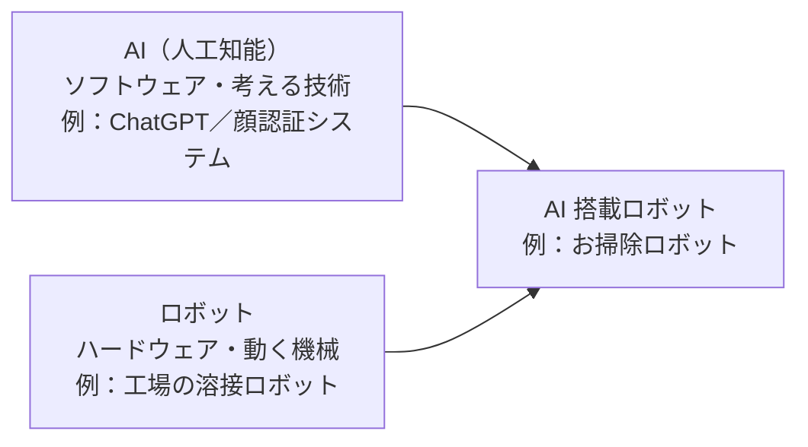
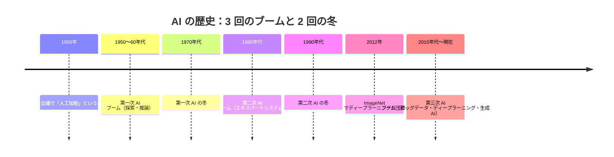
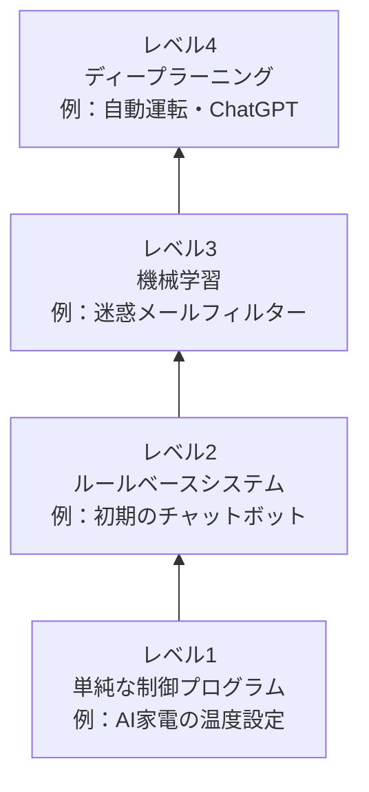
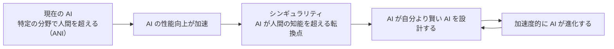

# Lesson-01：AIの基礎知識①（定義・歴史・分類）

> **対象章**: 第1章

---

## 1. はじめに：生成 AI パスポートとは

**生成 AI パスポート**は、生成 AI を正しく理解し使いこなすための知識を証明する資格試験である。

この講座は、試験に合格するための知識を身につけながら、実際に AI を使いこなせる力を育てることを目的としている。全 12 回の授業を通じて、AI の仕組みから実践的な使い方まで一緒に学んでいこう。

### この講座で身につくこと

- AI の仕組みを根拠をもって説明できる力
- AI を正しく・安全に活用できる判断力
- 自分でプロンプトを工夫し、AI を道具として使いこなす実践力

### 生成 AI パスポート試験の概要

| 項目 | 内容 |
|------|------|
| 出題形式 | 択一式・記述式の混合 |
| 出題範囲 | 第1〜5章（この授業でカバーする全範囲） |
| 目標 | AI を正しく理解し、倫理的に活用できることを証明する |

---

## 2. AI とは何か

### AI の定義

**AI（Artificial Intelligence：人工知能）** とは、人間の知能に近い思考や判断をコンピュータで実現する技術のことである。

具体的には、コンピュータが人間の知識を模倣して、**学習・推論・認識・意思決定**などのタスクを自動的にこなす。

> **ポイント**：AI は「賢いプログラム」ではない。大量のデータからパターンを学ぶことで、人間のような判断を行う仕組みである。

### AI の研究

AI の研究は、実は一つの技術ではなく、複数の研究分野の集合体である。

| 研究分野 | 扱うテーマ |
|---------|-----------|
| 探索・推論 | 目的の答えにたどり着くまでの道筋を計算する（パズル・ゲームなど） |
| 知識表現 | 人間の知識をコンピュータが扱える形で表す |
| 機械学習 | データからパターンや法則を自動的に見つけ出す（Lesson-02 で詳しく学ぶ） |
| 自然言語処理（NLP） | 人間の言葉を理解・生成する（Lesson-02・08 で詳しく学ぶ） |
| 画像認識・ロボティクス | 画像や音声を認識する、機械を制御する |

歴史的には、「ルールを記号で書いて論理的に考えさせる」流れ（記号処理）と、「脳の仕組みを真似て大量データから学ばせる」流れ（ニューラルネットワーク）という 2 つの研究の潮流が存在し、これらが競い合い、また補い合いながら AI 全体の発展を支えてきた。

### AI とロボットの違い

混同しやすいが、AI とロボットは別の概念である。

| 比較 | ロボット | AI |
|------|---------|-----|
| 本質 | 物理的な機械（アーム・センサーなど） | ソフトウェア（プログラム）の技術 |
| 主な目的 | 動くこと・作業すること | 考えること・判断すること |
| 存在形態 | 実体がある | 実体は必要ない（クラウドにも存在できる） |
| 例 | 工場の溶接ロボット | ChatGPT・顔認証システム |

ロボット掃除機のように「AI を搭載したロボット」という組み合わせも存在するが、それぞれ独立した技術である。

### AI が活躍している場面

AI は私たちの日常の中に、すでに深く入り込んでいる。

| 分野 | AI の使われ方 |
|------|-------------|
| 医療 | 病気の早期発見・CT 画像の自動診断・新薬の開発支援 |
| 教育 | 一人ひとりに合わせた学習サポート・採点の自動化 |
| 製造 | 工場の自動化・製品の品質検査・不良品の検出 |
| 生活 | スマートスピーカー（Siri・Alexa）・動画レコメンド（YouTube・Netflix） |
| 交通 | 自動運転技術・渋滞予測・鉄道の遅延予測 |
| 農業 | 作物の生育状況のモニタリング・害虫検知 |

### 確認クイズ①

> Q：「AI 搭載のロボット掃除機」において、「AI」と「ロボット」はそれぞれ何の役割を担っているか？

（例：ロボット → 部屋を移動して掃除する、AI → 障害物を認識して避けるルートを計算する）

---

## 3. AI の歴史：3 回のブーム

AI の研究は 70 年以上の歴史を持ち、大きく3回のブームがあった。ブームと冬（停滞期）を繰り返しながら進化してきた点が特徴的である。

### 第一次 AI ブーム（1950〜60 年代）：AI の誕生

**きっかけ：ダートマス会議（1956 年）**

- アメリカのダートマス大学で開催された、AI 研究の出発点となる会議。
- 数学者・計算機科学者の **ジョン・マッカーシー** が、「人工知能（Artificial Intelligence）」という言葉を提唱した。
- マービン・ミンスキーなど当時の著名な研究者が集まり、AI 研究の方向性を議論した。

**この時代の AI の特徴**

- チェスプログラムや数学の定理証明など、「**探索（search）**」と「**推論（reasoning）**」を用いたプログラムが注目された。
- コンピュータが論理的に考えて答えを導き出す能力に、多くの研究者が興奮した。

**なぜブームが終わったか（AI の冬）**

- 現実世界の複雑な問題（自然言語・曖昧な状況判断など）は解けなかった。
- 計算機の性能が不十分で、処理に限界があった。
- 期待に比べて成果が少なく、研究への資金が打ち切られ「**AI の冬**」と呼ばれる停滞期に入った。

---

### 第二次 AI ブーム（1980 年代）：エキスパートシステムの時代

**エキスパートシステムとは**

- 「もし症状が○○であれば、病名は△△である」のように、**専門家の知識をルールとして大量にプログラムに書き込んだ** AI システム。
- 医療診断・法律相談・製品の故障診断などで実際に企業・機関に導入された。

**ルールベース AI の限界**

- 人間が作るルールに依存するため（**ルールベース**）、ルールに書かれていない状況には対応できない。
- 現実の世界は複雑すぎて、すべてのルールを人間が書き切ることは不可能だと判明した。
- ルールの量が増えすぎて、矛盾やメンテナンスの問題が生じた。

→ 再びブームが冷め、第二次の「AI の冬」が訪れた。

---

### 第三次 AI ブーム（2010 年代〜現在）：ディープラーニングの革命

**転換点：ImageNet 2012**

- 2012 年、カナダの研究者グループが **ディープラーニング（深層学習）** を使って、画像認識コンテスト「ImageNet」で圧倒的な精度を叩き出した。
- 従来の手法との差が歴然として、世界中の研究者に衝撃を与えた。
- 中心人物の一人が、ノーベル物理学賞（2024年）も受賞した **ジェフリー・ヒントン** 教授である。

**第三次ブームを支えた3つの要素**

| 要素 | 内容 |
|------|------|
| **ビッグデータ** | インターネットの普及で膨大なデータが収集できるようになった |
| **計算能力の向上** | GPU（グラフィクス処理用半導体）が AI 学習に活用されるようになった |
| **ディープラーニング** | 多層ニューラルネットワークで自動的に特徴を学習できる技術が確立された |

**現在（生成 AI の時代）**

- テキスト・画像・動画・音声を自由に生成できる **生成 AI** が登場。
- 2022 年 11 月、**ChatGPT** が一般公開されると、わずか 5 日間で 100 万ユーザーを突破した（Netflix が 100 万ユーザー達成に 3.5 年かかったのと比較すると驚異的なスピード）。

> **まとめ表**

| 時代 | ブーム名 | キーワード | なぜ終わったか |
|------|----------|-----------|--------------|
| 1950〜60年代 | 第一次 AI ブーム | ダートマス会議・探索・推論 | 現実の複雑な問題に対応できなかった |
| 1980年代 | 第二次 AI ブーム | エキスパートシステム・ルールベース | ルールの限界・管理の困難さ |
| 2010年代〜 | 第三次 AI ブーム | ビッグデータ・ディープラーニング・生成 AI | 現在進行中 |

---

### コラム：ジョン・マッカーシーとは？

ジョン・マッカーシー（1927〜2011）はアメリカの数学者・コンピュータ科学者。AI という言葉を作っただけでなく、プログラミング言語「LISP」の開発者としても知られる。
「AI の父」とも呼ばれる偉人であり、最終的に AI 研究の功績でチューリング賞（コンピュータ科学界のノーベル賞）を受賞している。

---

## 4. AI の分類

### 特徴量とは

AI がデータを判断する際に注目する「手がかりとなる数値・性質」のことを **特徴量** という。

> イメージ：猫を見分けるとき、人間は「耳の形」「ひげの本数」「毛の色」といった手がかりに自然と注目している。AI も同じように、判断に使う手がかり（特徴量）をデータの中から取り出して利用している。

従来の機械学習では人間が特徴量を指定する必要があったが、ディープラーニングでは AI が特徴量そのものを自動的に見つけ出せるようになった（詳しくは Lesson-02 で学ぶ）。

### ANI と AGI

AI は目指す知能の範囲によって 2 種類に分けられる。

**ANI（Artificial Narrow Intelligence：特化型 AI・弱い AI）**

- 特定の 1 つのタスクに特化して作られた AI。
- そのタスクでは人間を超える能力を発揮できるが、別のタスクには使えない。
- 現在あるほぼすべての AI は ANI である。

具体的な例：

| ANI の例 | 得意なこと | 苦手なこと |
|---------|-----------|-----------|
| 将棋 AI（Ponanza など） | 将棋の手を考える | 囲碁・チェスはできない |
| 顔認証 AI | 顔を認識して本人確認する | 感情を理解することはできない |
| 翻訳 AI（DeepL） | 文章を別の言語に翻訳する | 文章の感情的ニュアンスを完全には理解できない |
| 画像診断 AI | CT 画像からがんを検出する | 患者の気持ちに寄り添うことはできない |

**AGI（Artificial General Intelligence：汎用型 AI・強い AI）**

- 人間と同等かそれ以上の知能を持ち、どんな分野にも対応できる AI。
- 映画「アイアンマン」の AI アシスタント「J.A.R.V.I.S.」がイメージに近い。
- 現時点ではまだ実現していない（研究・開発中）。
- 「AGI が実現するのはいつか？」という議論が AI の世界で盛んに行われている。

### AI のレベル別分類

AI は能力の複雑さによって 4 段階に分類することもできる。

| レベル | 内容 | 例 |
|--------|------|----|
| レベル1 | 入力に対して決まった出力を返す単純なプログラム | AI 家電の温度設定 |
| レベル2 | ルールベースシステムで予測や判断をする | 初期のチャットボット |
| レベル3 | **機械学習**で自らデータパターン（特徴量）を学習する | 迷惑メールフィルター・スポーツ選手のパフォーマンス予測 |
| レベル4 | **ディープラーニング**で高度な認識・判断をする | 自動運転技術・ChatGPT |

### やってみよう：身近な AI を探してみよう

自分が 1 日の生活の中で使っている（または使われている）AI を 3 つ探して、それぞれ「何ができるか」を書いてみよう。

| 場面 | AI の名前（わかれば） | できること |
|------|-------------------|-----------|
| 1 | | |
| 2 | | |
| 3 | | |

---

## 5. シンギュラリティ（技術的特異点）

### シンギュラリティとは

**シンギュラリティ（Singularity：技術的特異点）** とは、AI が人間の知能を超え、AI 自らがより高性能な AI を設計・開発できるようになる転換点のことである。

「特異点」という名前は、数学でグラフが急激に跳ね上がる点を「特異点」と呼ぶことから来ている。AI の進化スピードが爆発的に加速するイメージから使われている。

この点を超えると、技術の進歩が爆発的に加速し、人間社会に計り知れない影響が生じると考えられている。

### シンギュラリティが起きると何が変わる？

- AI が自分より賢い AI を次々と作り出し、人間には追いつけないスピードで進化する
- 今まで人間にしかできなかった仕事・創造・研究をすべて AI が担えるようになる可能性がある
- 人間とどのように共存するかが最大の課題になる

### 2045年問題

シンギュラリティを最初に提唱したのは数学者・SF 作家の **ヴァーナー・ヴィンジ** であり、1993年の論文でこの概念を広めた。

未来学者の **レイ・カーツワイル** は、**2045年頃** にシンギュラリティが到来すると予測している（**2045年問題**）。

- カーツワイルはコンピュータ科学者・発明家で、技術の進化を数十年単位で正確に予測してきた実績を持つ。
- 現在は Google の技術部門で研究を続けている。
- 「2045年問題」という言葉は、AI の未来を考えるうえで欠かせない概念になっている。

### AI 効果

興味深い現象として、AI がある能力を達成すると「それは本当の知能ではない」と言われる傾向がある。これを **AI 効果（AI Effect）** という。

- チェスで人間を超えた AI → 「計算しているだけで知能ではない」と言われた
- 囲碁で人間を超えた AI → 「パターン認識だから本物ではない」と言われた
- 会話できる AI（ChatGPT）→ 「確率的な文字列生成に過ぎない」と言われた

AI ができることが増えるほど、人間はそれを「知能とは違う」と言い張る。これは AI の本質を考える上でとても面白い現象である。

---

### コラム：AI にできなかった「ルービックキューブ」

2019 年、OpenAI はロボットアームを AI で制御し、ルービックキューブを片手で解くことに成功した。この AI は人間から「ルービックキューブを解け」と命令されたわけではなく、「手を動かして目標の状態を達成する」という報酬設定から自力で学習し、最適な動作を習得した。これが「強化学習」の力である（詳しくは Lesson-02 で学ぶ）。このような AI も、あくまでも ANI（一つのタスク特化）である点に注目しよう。

---

## 授業のまとめ

今回学んだ重要キーワードを確認しよう。

| キーワード | 意味 |
|-----------|------|
| AI（人工知能） | 人間の知能を模倣するコンピュータ技術。学習・推論・認識・意思決定を担う |
| ダートマス会議 | 1956年、「人工知能」という言葉が生まれた歴史的な会議（マッカーシーが主導） |
| 第一次 AI ブーム | 探索・推論の時代（1950〜60年代）。チェスプログラムなどが注目された |
| エキスパートシステム | 専門家の知識をルール化した第二次ブームの主役。限界からブームは終息 |
| ビッグデータ | 第三次ブームを支えた大量のデータ。インターネット普及で収集可能になった |
| ディープラーニング | 多層ニューラルネットワークで特徴を自動抽出する技術。第三次ブームの核心 |
| 特徴量 | AI が判断の手がかりとして使うデータの性質・数値 |
| ANI | 特定タスク専用の AI（現在の AI の大半）。例：翻訳 AI・顔認証 AI |
| AGI | 人間と同等の汎用 AI（まだ実現していない） |
| シンギュラリティ | AI が人間の知能を超える転換点。技術が爆発的に進歩する分岐点 |
| 2045年問題 | レイ・カーツワイルが予測したシンギュラリティの到来年 |
| AI 効果 | AI の能力を「本当の知能ではない」と見なす傾向 |
| ルールベース | 人間がすべてのルールを書き込む古典的な AI の作り方 |

---

## 最終確認クイズ

1. AI という言葉を生んだ会議の名前と、それが開かれた年は？
2. 第二次 AI ブームの中心的な技術は何か？
3. ANI と AGI の違いを 1 文で説明してみよう。
4. シンギュラリティとは何か。「AI が〜する転換点」という形で答えよ。
5. レイ・カーツワイルはシンギュラリティが何年ごろに来ると予測したか？
