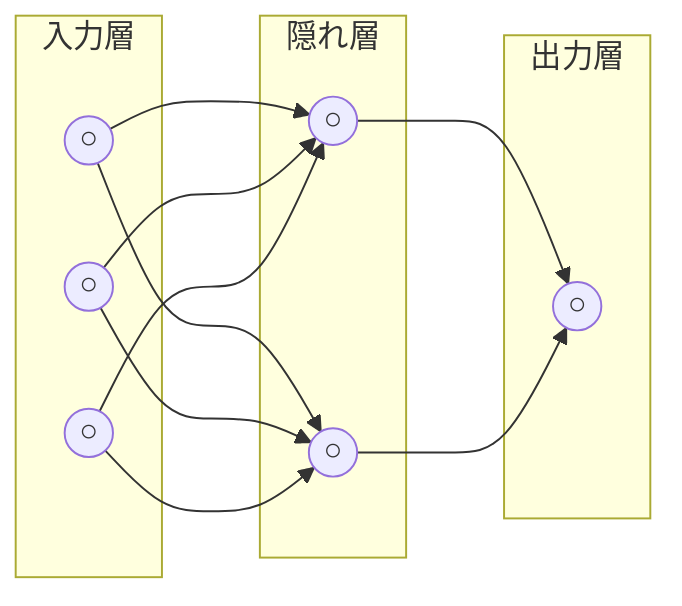

# Lesson-02：AIの基礎知識②（機械学習・ディープラーニング・過学習）

> **対象章**: 第1章

---

## 復習クイズ（Lesson-01）

まずは前回の内容を思い出してみよう。

1. AI の歴史の3つのブームを時系列で言えるか？それぞれのキーワードは？
2. ANI と AGI の違いは？現実に存在するのはどちらか？
3. シンギュラリティとは何か？何年に来ると予測されているか？

---

## 1. ルールベースと機械学習

### ルールベースとは

**ルールベース**とは、人間が「もし〇〇ならば△△する」というルールを事前に大量にプログラムに書き込む方法である。

具体例：スパムメールフィルター（ルールベース版）
```
もし「無料」という単語が件名にあれば → スパムとして分類する
もし「当選」という単語があれば → スパムとして分類する
もし送信者が知らないアドレスで「至急」が含まれれば → スパムとして分類する
...（このルールを数百〜数千個書く）
```

**メリット・デメリット**

| 比較 | 内容 |
|------|------|
| メリット | 動作が予測しやすく、なぜその判断をしたかを説明しやすい |
| デメリット | 現実の複雑な問題には対応しきれない。ルールが増えると管理が大変。新しいパターンが出るたびに人間が追記しなければならない |

### 機械学習とは

**機械学習**とは、人間がルールを書き込む代わりに、コンピュータ自身が大量のデータからパターンや法則を見つけ出す方法である。

> イメージ：「猫の写真を1万枚見て、自分で『これが猫だ』という法則を見つける」

学習を終えたモデルを **学習済みモデル** という。学習済みモデルは、まだ見たことのないデータにも対応できる（汎化能力）。

| 比較 | ルールベース | 機械学習 |
|------|-------------|---------|
| ルールの作成者 | 人間 | AI 自身 |
| 新しい状況への対応 | 人間が追記が必要 | データから自動で学習 |
| 説明のしやすさ | なぜその判断をしたかを説明しやすい | 「なぜ」を説明しにくい（ブラックボックス問題） |
| 向いている場面 | 単純・明確なルール | 複雑・大量のデータ |

> **ポイント**：機械学習はルールを「学ぶ」のではなく、ルール自体を「発見する」技術である。

---

## 2. 機械学習の 4 つの手法

### 教師あり学習

**正解ラベル（答え）付きのデータ**を使って、未知のデータに対して正しい出力を予測するモデルを作る方法。

イメージ：「答えつきの問題集を何万問も解き続けて、正しい答え方のパターンを覚える」

**活用例**

| タスク | 具体例 |
|--------|--------|
| 分類 | 迷惑メールを「迷惑 or 迷惑でない」に分ける。画像を「犬 or 猫」に分ける |
| 回帰 | 家の広さや立地から「価格」を予測する。明日の気温を予測する |
| 感情分析 | レビュー文章が「ポジティブ or ネガティブ」かを判定する |

**データセットの構造**

```
入力データ（特徴）         正解ラベル
「この映画は最高でした！」 → ポジティブ
「期待外れだった...」      → ネガティブ
「普通だったかな」         → ニュートラル
```

これを何万件も学習させることで、新しいレビューを見ても感情を判定できるようになる。

---

### 教師なし学習

**正解ラベルなしのデータ**を使い、データの構造やパターンを自分で見つけ出す方法。

イメージ：「答えなしのデータの山から、似ているものどうしを自分でグループ分けする」

**代表的な技術**

**クラスタリング**：似ているもの同士をグループ（クラスター）に分ける技術

```
例：顧客データの分析
・よく本を買う人グループ
・スポーツ用品をよく買う人グループ  
・食料品だけを買う人グループ
→ 正解ラベルなしで、勝手にグループに分かれる
```

活用場面：異常検知（工場の機械の不具合の早期発見）・顧客セグメンテーション・不正検知

**次元削減**：データの情報を保ちながら、次元（特徴の数）を減らして扱いやすくする技術

- 例：100 個の特徴量（身長・体重・年齢・購入履歴...）を 2〜3 個の主要な特徴にまとめる
- グラフで可視化しやすくなる、計算コストが下がる、などのメリットがある

---

### 強化学習

**報酬**（目標）を設定し、それを達成するための最適な行動を繰り返し試行して学習する方法。

イメージ：「ゲームで何度も失敗しながら、どうすれば高スコアを取れるかのコツを掴んでいく」

**仕組みの流れ**

```mermaid
graph LR
    A["AI エージェント<br/>（学習する主体）"] -->|行動を選択| B["環境<br/>（ゲーム・シミュレーション）"]
    B -->|報酬(+点)／ペナルティ(−点)を返す| C["報酬"]
    C -->|報酬が多くなるように行動を更新| A
```

**活用例**

| 分野 | 具体例 |
|------|--------|
| ゲーム AI | AlphaGo（囲碁）・Atari ゲームを自力でクリアする AI |
| 自動運転 | 交通状況に応じてハンドル・アクセル・ブレーキを学習 |
| ロボット制御 | 二足歩行ロボットが転ばずに歩く方法を学習 |
| 広告配信 | どの広告をどのユーザーに出すと効果的かを最適化 |

---

### 半教師あり学習

教師あり学習と教師なし学習を組み合わせた**ハイブリッド型**。

**背景**：正解ラベルをつける作業（アノテーション）は人間の手作業が必要で非常にコストがかかる。

- ラベルのついたデータ（少量） ＋ ラベルなしデータ（大量）を組み合わせて学習する
- 大量のラベルなしデータを効率よく活用できる

例：1000 枚の写真のうち、ラベルがついているのは 100 枚だけ。残り 900 枚の「構造・パターン」も活用して精度を上げる。

---

### 4 手法の比較表

| 手法 | データのラベル | 主な目的 | 代表例 |
|------|-------------|---------|--------|
| 教師あり学習 | 必要（正解つき） | 分類・予測 | 迷惑メール判定・価格予測 |
| 教師なし学習 | 不要 | クラスタリング・次元削減 | 顧客分類・異常検知 |
| 強化学習 | 不要（報酬で代替） | 最適行動の発見 | ゲーム AI・ロボット制御 |
| 半教師あり学習 | 一部だけ必要 | ラベルなしデータの有効活用 | 医療画像診断支援 |

---

## 3. ノーフリーランチ定理

> 「**どんな問題にも万能に使える汎用的なモデルは存在しない**」

これを **ノーフリーランチ定理（No Free Lunch Theorem）** という。

つまり、「どの機械学習手法が一番いいか」という絶対的な答えはなく、**問題に応じて最適な手法を選ぶことが重要**だということを意味する。

例え話：「どんな料理にも合う万能の調味料はない」と同じ発想。塩は肉料理に合うが、あんこには合わない。醤油は和食に合うが、ケーキには合わない。

→ AI の世界でも、どんな問題にもベストな1つの手法はなく、問題に合わせて最適な手法を選ぶことが大切。

---

## 4. ニューロンとニューラルネットワーク

### ニューロンとシナプス

人間の脳は、約 860 億個の **ニューロン（神経細胞）** がつながって情報を伝えている。ニューロンどうしのつながる部分を **シナプス** という。

この「脳の仕組み」をコンピュータで再現したものが **人工ニューロン（ノード）** である。

### ニューラルネットワークの構造

人工ニューロンを多数つなげたネットワーク全体を **ニューラルネットワーク** という。



- **入力層**：データを受け取る（例：猫の写真のピクセル情報）
- **隠れ層**：特徴を抽出・変換する（例：エッジ → 形 → 目・耳 → 顔）
- **出力層**：最終的な答えを出す（例：「猫である確率 98%」）

> 関係の大きさ：人工ニューロン（ノード） ＜ ニューラルネットワーク ＜ ディープラーニング

### 重みと重みづけ

シナプスには「どの信号が大切か」という差があり、この大切さの度合いを **重み（Weight）** という。重みを調整することで「重要な情報に注目する」仕組みができる。この調整作業を **重みづけ** という。

例え話：
- 成績を予測するときに「テストの点数」の重みを高くして「出席率」の重みを低くする
- これで「テストの点数がより重要」という判断ができるようになる

**逆伝播（バックプロパゲーション）**

重みを自動調整するしくみ。答えの誤差を出力層から入力層に向かって逆方向に伝えながら、「どの重みをどのくらい変えればよいか」を計算して少しずつ修正する。

---

## 5. ディープラーニング（深層学習）

**ディープラーニング**とは、ニューラルネットワークを多数の層（レイヤー）で構成し、大量のデータから特徴を自動的に抽出する技術である。

**従来の機械学習との最大の違い**

| 項目 | 従来の機械学習 | ディープラーニング |
|------|-------------|----------------|
| 特徴量の設定 | 人間が手動で設定する必要があった | AI が自動的に学習する |
| 必要なデータ量 | 少なくてもよい | 大量のデータが必要 |
| 計算コスト | 比較的低い | 高い（GPU が必要） |
| 精度 | タスクによる | 大量データがあれば高精度 |

> イメージ：画像から「耳の形」「ひげの有無」という特徴を人間が指定しなくても、AI が自分で「猫らしさ」を覚えていく。

**ディープラーニングで可能になったこと**

- 画像認識：写真を見て「これは犬」「これはリンゴ」と判断する
- 音声認識：話し言葉をテキストに変換する（Siri・Google アシスタント）
- 自然言語処理：文章の意味を理解して翻訳・要約・質問応答を行う
- 生成 AI：新しい画像・文章・音楽を自ら生成する

---

## 6. 過学習（オーバーフィッティング）と対策

### 過学習とは

**過学習（オーバーフィッティング）** とは、AI が学習用データのパターンを「覚えすぎ」てしまい、学習用データでは高い精度を出すが、**新しいデータには対応できない**状態のことである。

> イメージ：テスト問題を丸暗記したため、問題の言い回しが変わると答えられなくなった状態。

```
学習データでの精度：98%（暗記しているから高い）
未知データでの精度：62%（暗記では対応できない）
→ これが過学習
```

**過学習が起きる原因**

- 学習データが少なすぎる
- モデルが複雑すぎる（パラメータが多すぎる）
- 学習を続けすぎる

### 過学習の対策

| 対策 | 内容 | イメージ |
|------|------|---------|
| **アーリーストッピング** | 学習の途中で精度がそれ以上改善されなくなったら、早めに停止する | 勉強しすぎず、丁度いいところで止める |
| **正則化（Regularization）** | パラメータを調整して、モデルが複雑になりすぎないよう制御する | 癖がつきすぎないようブレーキをかける |
| **ドロップアウト（Dropout）** | 学習中にランダムにいくつかのニューロンを無効化し、特定のパターンに頼りすぎないようにする | 特定の人だけに頼らずチーム全体で対応できるようにする |
| **データ拡張** | 学習データを回転・反転・変形などで人工的に増やす | 問題のバリエーションを増やして練習する |

### 転移学習

**転移学習**とは、一つのタスクで学んだ知識を別のタスクに活用する手法である。

- すでに大量データで学習済みのモデルをベースにして、新しいタスクに合わせて微調整（**ファインチューニング**）する
- 少ないデータと計算コストで高性能なモデルを作れる

> イメージ：すでに野球をマスターした選手が、ソフトボールに転向する場合、バットの振り方・走塁の基礎などを一から練習しなくてよい。野球で学んだスキルをそのまま活かして、ソフトボール固有のルールだけ追加で学べばよい。

**活用例**

| もとの学習 | 転移先のタスク |
|----------|-------------|
| 大量の英語テキストで学習した LLM | 日本語の文章生成 |
| ImageNet で学習した画像認識 AI | 医療画像（X 線・CT）の診断 |
| 一般的な対話 AI | 特定企業の顧客サポート AI |

---

### コラム：ドロップアウトの面白い発想

ドロップアウトの着想は「チームで一人の天才に頼りすぎてはいけない」という考え方から来ている。学習中に一部のニューロンをランダムに無効化することで、残ったニューロンが協力してタスクをこなせるようになる。結果的に、どのニューロンも過剰に特定のパターンに特化しなくなり、新しいデータへの対応力（汎化能力）が向上する。チームでの仕事と同じ考え方が、機械学習の世界でも大切なのは興味深い。

---

## 授業のまとめ

| キーワード | 意味 |
|-----------|------|
| ルールベース | 人間がルールをプログラムに書き込む方法 |
| 機械学習 | AI がデータから自分でパターンを学ぶ方法 |
| 学習済みモデル | 学習を終えた AI モデル |
| 教師あり学習 | 正解ラベル付きデータで分類・予測を学ぶ |
| 教師なし学習 | ラベルなしデータで構造を探す（クラスタリング・次元削減） |
| 強化学習 | 報酬で最適行動を繰り返し試して学習する |
| 半教師あり学習 | 少量のラベルあり＋大量のラベルなしを組み合わせる |
| ノーフリーランチ定理 | 万能な手法は存在しない。問題に応じて最適な手法を選ぶ |
| ニューロン・シナプス | 脳の神経細胞・その接続部分。AI でも同じ構造を模倣 |
| 重み | 情報の重要度を数値化したもの |
| ニューラルネットワーク | 人工ニューロンをつなげたネットワーク（入力層・隠れ層・出力層） |
| ディープラーニング | 多層ニューラルネットワークで特徴を自動抽出する |
| 過学習 | 学習データへの適応しすぎ。未知データに弱くなる |
| 正則化 | 過学習を防ぐパラメータ調整 |
| ドロップアウト | ランダムにニューロンを無効化して過学習を防ぐ |
| 転移学習 | 学習済みモデルの知識を別タスクに活用する |

---

## 演習：機械学習の手法を当てはめよう

次の場面に使われている機械学習の手法は何か。教師あり・教師なし・強化学習・半教師あり のどれかを選んで理由を書こう。

1. Netflix が「あなたへのおすすめ動画」を表示する（過去の視聴履歴を使い、ラベルなしで類似ユーザーをグルーピング）
2. 将棋 AI が何千万回も対局を繰り返してプロ棋士より強くなる
3. 病院が 1000 枚のレントゲン写真のうち 100 枚だけ「がん」「正常」のラベルをつけ、残り 900 枚も使って診断 AI を作る
4. AI が「これはスパムメール」「これは正常なメール」という正解付きデータで学習する
