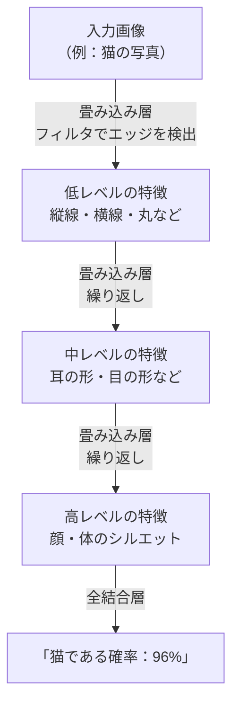
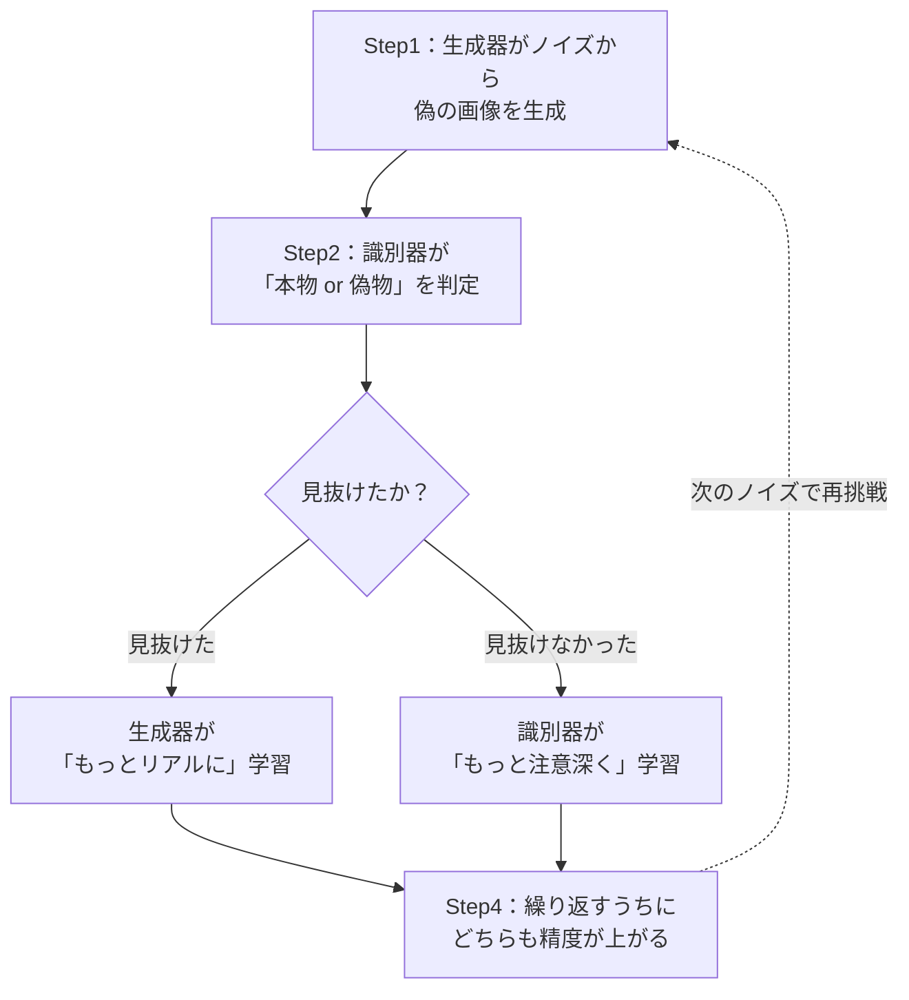
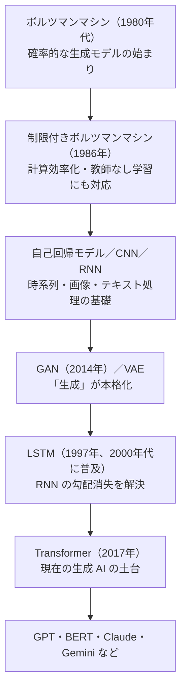

# Lesson-03：生成AIの誕生①（ボルツマンマシン〜Transformerの系譜）

> **対象章**: 第2章

---

## 復習クイズ（Lesson-02）

1. 機械学習の 4 手法を答え、それぞれの特徴を一言で説明せよ。
2. 過学習とは何か？それを防ぐ方法を 2 つ答えよ。
3. ドロップアウトはどのような方法で過学習を防ぐか？

---

## この授業のテーマ：「なぜ今の AI は高性能なのか」

今使われている ChatGPT や Claude などの生成 AI は、**Transformer** というモデルをベースに作られている。では、Transformer はどうして生まれたのか？

それを理解するには、過去のモデルが「何が課題だったか」を知る必要がある。この授業では、各モデルがどんな問題を解決しようとして、どんな新しい課題を残したかを順番に追っていく。

---

## 1. 生成 AI の誕生：最初のモデルたち

### ボルツマンマシン（1980年代）

1980年代後半、**ジェフリー・ヒントン** と **テレンス・セジノフスキー** が率いるグループが提唱した、初期の生成モデルである。

**仕組み**

- ニューラルネットワークの一種で、確率的に動作する
- 「確実な 1 つの答え」ではなく、「可能性のある答えを複数生成し、最も確率が高いものを選ぶ」という方法で動く

> イメージ：骰子（サイコロ）を振って出た目の確率分布を学習する。「このデータが出る確率」を学習することで、似たデータを生成できるようになる。

**課題**

- 学習できるデータ量は増えたが、ニューロン間の接続がすべて繋がっているため、処理に膨大な時間と計算資源が必要だった
- 実用化は困難だったが、後の生成モデルへの道を開いた

### 制限付きボルツマンマシン（RBM）

ボルツマンマシンの課題を改善するために **1986年** に開発されたモデル。

**改善点**

- ニューロン間の接続に「制限（ルール）」を設けることで計算を効率化した
- ネットワークを **可視層（入力：データを受け取る部分）** と **隠れ層（出力：特徴を抽出する部分）** の 2 層に分けて処理する
- これにより、教師あり学習だけでなく **教師なし学習** でも有効に機能するようになった

**活用**

- ディープラーニングの事前学習（プレトレーニング）に使われた
- 音楽・映画のレコメンドシステムなどに応用された

### 自己回帰モデル

- **過去のデータから次を予測する** 仕組み
- 天気予報や株価のような **時系列データ** の予測に適している
- テキスト生成でも「前の単語から次の単語を予測する」形で活用される

> 例：「今日は天気が＿＿」→ 過去の大量の文章から「良い」「悪い」「晴れ」などが続く確率を計算し、最も高い確率の単語を選ぶ

---

## 2. CNN（畳み込みニューラルネットワーク）

**CNN（Convolutional Neural Network）** は画像認識・画像処理に特化したモデルである。

### 仕組み

画像の **局所的な領域（一部分）** にフィルタをかけて特徴を抽出し、それを次の層に渡す処理を繰り返す。これを **畳み込み（Convolution）** という。

**処理の流れ**



> イメージ：虫眼鏡で画像の一部分ずつを拡大して「ここに耳がある」「ここに目がある」と確認していき、最終的に「全体として猫だ」と判断する。

**活用場面**

- 画像分類（犬か猫かを判定）
- 物体検出（写真の中の人物・車を枠で囲む）
- 顔認識（スマートフォンのロック解除）
- 医療画像診断（がん細胞の検出）
- 画像生成 AI の一部（特徴抽出に使われる）

---

## 3. VAE（変分自己符号化器）

**VAE（Variational Autoencoder）** はデータを圧縮して新しいデータを生成できるモデルである。

### 構成

| 部品 | 役割 |
|------|------|
| **エンコーダ** | 入力データを「潜在ベクトル（低次元の数値表現）」に圧縮する |
| **デコーダ** | 潜在ベクトルから元に近いデータを復元する |

- **潜在ベクトル（潜在変数）**：大きなデータを小さな数値の集まりに変換したもの

> イメージ：大きなファイルを ZIP 圧縮して（エンコーダ）、また解凍する（デコーダ）ようなもの。ただし ZIP と違い、圧縮した後の「数値を少し変える」ことで、元とは違う新しいデータを生成できる。

**VAE が「生成」できる理由**

- 通常のオートエンコーダ（圧縮＋復元のみ）と違い、VAE は「潜在空間に確率分布」を学習する
- 潜在ベクトルをランダムにサンプリングして、元のデータと似ているが新しいデータを生成できる

**活用場面**

- 画像のノイズ除去・欠損補完
- 特徴学習・次元削減
- 異常検知（正常データの分布から外れるものを検出）
- 薬物分子の生成（新薬候補を探索する研究）

---

## 4. GAN（敵対的生成ネットワーク）

**GAN（Generative Adversarial Network）** は、2 つのネットワークが競い合いながら学習する強力な生成モデルである。2014年に **イアン・グッドフェロー** が提案した。

### 生成器と識別器

| 部品 | 役割 |
|------|------|
| **生成器（Generator）** | ランダムなノイズから「本物に見えるデータ」を生成しようとする |
| **識別器（Discriminator）** | 生成器が作ったデータと本物のデータを見分けようとする |

両者が競い合うことで、生成器はどんどん「本物らしい」データを作れるようになる。

> イメージ：生成器＝「偽札を作る人」、識別器＝「偽札を見破る銀行員」。お互いが切磋琢磨することで、偽札はより精巧になり、見破る技術もより高まる。最終的に識別器でも見分けがつかないほどリアルな生成物が完成する。

### 学習の流れ



### GAN の課題

- **モード崩壊（Mode Collapse）**：生成器が多様なデータを作らず、同じようなデータを繰り返し生成してしまう問題
- 学習が不安定になりやすい
- 識別器と生成器のバランスを取るのが難しい

**活用場面**

- 高品質な画像生成
- 絵画スタイルの変換（写真を絵画風に変換）
- データ拡張（学習データの水増し）
- ディープフェイク生成（悪用リスクに注意）

---

## 5. RNN と LSTM

### RNN（回帰型ニューラルネットワーク）

**RNN（Recurrent Neural Network）** は、時間的に連続したデータ（シーケンスデータ）を扱うモデルである。

- **シーケンスデータ**：文章・音声・音楽・株価など、順番に意味があるデータ
- **リカレント層（隠れ層）**：前の時点の出力を次の計算に受け渡す特殊な層

```
「今日は天気が良い」
　↓ RNN の処理
今日 → 「は」 → 天気 → 「が」 → 良い

各単語を処理するたびに、前の単語の情報を引き継ぎながら理解していく
```

> イメージ：文章を「今日」「は」「天気」「が」「良い」と 1 単語ずつ順番に読み進めながら、前の単語の意味を記憶して次の理解に活かす。本を先頭から 1 ページずつ読む感じ。

**問題点：勾配消失（Vanishing Gradient）**

長い文章を処理しようとすると、初めの方の情報がだんだん薄れて消えてしまう問題（**勾配消失**）が起きやすかった。

> 例：「私は昨日公園で友達と会って、そのあと映画を見て、その映画の感想は＿＿」という長い文で、「私は」の情報が薄れてしまうため、「彼 or 彼女」が誰のことかわからなくなる。

### LSTM（長・短期記憶）

**LSTM（Long Short-Term Memory）** は、RNN の「勾配消失」問題を解決するために開発されたモデル。1997年にホッホライターとシュミットフーバーが提唱。

**LSTM の仕組み：「記憶の門」**

LSTM は「どの情報を記憶し、どの情報を忘れるか」を制御する 3 つの「ゲート（門）」を持つ。

| ゲート | 役割 |
|--------|------|
| 入力ゲート | 新しい情報をどれだけ記憶に加えるか決める |
| 忘却ゲート | 既存の記憶をどれだけ忘れるか決める |
| 出力ゲート | 記憶をどれだけ出力に使うか決める |

> イメージ：重要なメモだけを書き留めるノートのようなもの。「この情報は大事（忘却ゲートを開かない）」「この情報は古いから消す（忘却ゲートを開く）」と判断しながら情報を管理する。

**LSTM でも残った課題**

- 長文になると精度が下がりやすい
- 時系列処理のため、並列学習（同時並行処理）に向かない
- 大規模データの学習に時間がかかりすぎる

→ これらをすべて解決するために開発されたのが **Transformer** である。

---

## 6. Transformer モデル（2017年）

**Transformer** は、2017年に Google の研究者が発表した論文「Attention is All You Need」で提案されたモデルで、現在の生成 AI の根幹となっている。

> タイトルの意味：「必要なのは注意機構だけだ」― CNN も RNN も不要で、注意機構だけで十分だという大胆な主張だった。

### 従来との最大の違い

| 項目 | RNN/LSTM | Transformer |
|------|---------|-------------|
| 処理方法 | 順番に 1 つずつ処理 | すべてを同時並行で処理（並列処理） |
| 長距離の関係 | 遠くの単語は忘れやすい | 遠くの単語も同じように参照できる |
| 学習速度 | 遅い（並列化できない） | 速い（GPU で並列処理できる） |

### 自己注意機構（Self-Attention / Attention Mechanism）

Transformer の核心技術。文の中のすべての単語が、お互いにどれだけ関係しているかを数値（**重み**）で表す。

**具体例**

```
「彼女は橋の上に立っていた。彼女のスカーフが風に揺れた。」

2文目の「彼女」が誰のことか → 1文目の「彼女」と同一人物
自己注意機構がこの関係を「重み」として数値化し、文脈を正しく理解する
```

| 単語 | 「彼女」との注意の重み（例） |
|------|------------------------|
| 橋 | 0.1（関係が薄い） |
| 立っていた | 0.3（行動として関連） |
| スカーフ | 0.7（彼女のものだと判断） |
| 風 | 0.1（直接関係なし） |

**これが革命的だった理由**

- 長文でも遠い位置にある単語どうしの関係を正確に捉えられる
- すべての単語の関係を同時に計算できる（並列処理が可能）

### 位置エンコーディング（Positional Encoding）

並列処理では「どの単語が何番目か」という語順情報が失われやすいため、各単語に**位置情報（数値）を付加**して語順を表現する仕組み。

> 例：「犬が猫を追いかけた」と「猫が犬を追いかけた」は単語が同じでも意味が全く違う。位置エンコーディングがなければ Transformer は語順を無視してしまう。

### マルチヘッドアテンション

自己注意機構を複数並行して実行する仕組み。異なる視点から同時に文脈を理解できる。

> イメージ：1 人の先生が全員の発言を聞くより、複数の先生が別々の観点（内容・感情・語順など）から生徒の発言を評価する方が、理解が深まる。

---

## 生成 AI 技術の系譜（まとめ）



---

## 授業のまとめ

| キーワード | 意味 |
|-----------|------|
| ボルツマンマシン | 確率的に動作する初期の生成モデル |
| 制限付きボルツマンマシン | 接続を制限して効率化（可視層・隠れ層の 2 層構造） |
| 自己回帰モデル | 過去データから未来を予測するモデル |
| CNN | 画像の局所的特徴を畳み込みで段階的に抽出 |
| VAE | エンコーダ（圧縮）＋デコーダ（復元）で新しいデータを生成 |
| 潜在ベクトル | データを圧縮した低次元の数値表現 |
| GAN | 生成器と識別器が競い合い高品質なデータを生成（グッドフェロー、2014年） |
| RNN | シーケンスデータを順番に処理するリカレント構造 |
| 勾配消失 | RNN で長期記憶ができなくなる問題 |
| LSTM | 3 つのゲートで RNN の勾配消失を解決した長・短期記憶モデル |
| Transformer | 自己注意機構で並列処理・長距離依存を解決（Google、2017年） |
| 自己注意（Self-Attention） | 単語どうしの関係を重みで数値化し文脈を理解する仕組み |
| 位置エンコーディング | 並列処理時の語順情報を付加する仕組み |

---

## 演習：各モデルの特徴整理

次の説明が当てはまるモデルを答えよ。

1. 画像の局所的な特徴（エッジ・形・顔のパーツ）を段階的に抽出するモデルは？
2. 「偽作者」と「識別者」が競い合うことで高品質なデータを生成するモデルは？
3. 長い文章でも遠くにある単語どうしの関係を重みで数値化できるモデルは？
4. データを圧縮（エンコード）して再生成（デコード）できるモデルは？
5. RNN の勾配消失問題を解決するために 3 つのゲート機構を持つモデルは？
