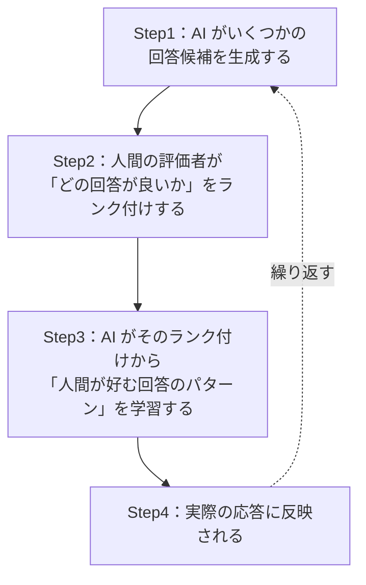

# Lesson-04：生成AIの誕生②（ChatGPTの歴史・主要生成AI）

> **対象章**: 第2章

---

## 復習クイズ（Lesson-03）

1. GAN の「生成器」と「識別器」それぞれの役割は何か？
2. LSTM は何の問題を解決するために作られたか？その仕組み（ゲート）も説明せよ。
3. Transformer の「自己注意機構」とはどのような仕組みか？

---

## 1. Transformer から生まれた派生モデル

Transformer が 2017年に発表されると、その構造を活用したさまざまなモデルが次々と生まれた。大きく「生成に強いモデル（GPT 系）」と「理解に強いモデル（BERT 系）」に分かれる。

### GPT モデル（OpenAI）

- **Generative Pre-trained Transformer**（生成・事前学習・Transformer）の略
- 大量のテキストデータで事前学習（プレトレーニング）し、文章を自動生成する
- 文章を「左から右へ」順番に読んで、**次の単語を予測**する「自己回帰型」のモデル

```
「今日は天気が」→ 次の単語は？
確率の高い順：「良い（35%）」「悪い（20%）」「晴れ（15%）」...
→ 「良い」を選んで文章を続ける
```

**活用**：対話・文章補完・コード生成・翻訳・要約

### BERT モデル（Google）

- **Bidirectional Encoder Representations from Transformers** の略
- テキストの**理解**に特化した、Transformer ベースのモデル
- GPT が「左から右」に読むのに対し、BERT は**双方向**で文脈を捉える

> 例：「私は銀行に行った。お金を引き出すために」という文で、BERT は「銀行」が後ろの「お金を引き出す」という情報も使って意味を理解できる。GPT は前の情報だけを使う。

**BERT の 2 つの学習方法**

| 学習方法 | 略称 | 内容 |
|---------|------|------|
| マスク言語モデル | MLM（Masked Language Model） | ランダムに単語を「マスク（隠す）」し、前後の文脈からその単語を当てる |
| 次文予測 | NSP（Next Sentence Prediction） | 2 つの文が連続する文かどうかを予測する |

```
MLM の例：
「私は___行った。お金を引き出すために」
→ マスクされた単語は「銀行に」と推測する
```

**BERT の活用**：質問応答システム・文書分類・感情分析・情報抽出

### RoBERTa（Facebook）

- 2019 年に Facebook（現 Meta）が BERT の改良版として発表
- BERT の約 10 倍のデータ量・長時間の学習・NSP タスクの廃止など、学習方法を最適化して性能を向上させた
- 多くの NLP タスクで BERT を超える精度を達成した

### ALBERT（Google）

- **A Lite BERT** の略。Google が開発した BERT の軽量版
- パラメータ数を大幅に削減（BERT の約 18 分の 1）し、計算資源が限られた環境でも高いパフォーマンスを発揮
- スマートフォンなどの端末でも動作できる軽量 AI の実現に貢献した

### GPT 系と BERT 系の違いまとめ

| 比較 | GPT 系 | BERT 系 |
|------|-------|---------|
| 方向性 | 左から右（自己回帰型） | 双方向 |
| 得意なこと | テキスト生成・対話 | テキスト理解・分類 |
| 代表例 | ChatGPT | Google 検索の改善 |

---

## 2. NLP（自然言語処理）とは

**NLP（Natural Language Processing：自然言語処理）** とは、コンピュータが人間の言語を理解し、生成し、操作する技術の総称である。

GPT・BERT など生成 AI の根幹をなす技術。NLP が可能にする主な機能：

| 機能 | 内容 | 具体例 |
|------|------|--------|
| 文章の理解 | テキストの意味を理解し質問に答える | ChatGPT への質問応答 |
| 文章の生成 | 自然な文章を生成する | メール・レポートの作成支援 |
| 翻訳 | ある言語から別の言語へ正確に翻訳する | DeepL・Google 翻訳 |
| 感情分析 | テキストに含まれる感情を判定する | SNS のコメント分析 |
| 要約 | 長い文章を要点を押さえてまとめる | ニュース要約・議事録作成 |

---

## 3. ChatGPT の歴史

### ChatGPT とは

**ChatGPT** は、OpenAI が開発した対話型 AI である。名前の意味は：

- **Chat**：対話型
- **G**：生成（Generative）
- **P**：事前学習（Pre-trained）
- **T**：Transformer

### GPT シリーズの進化の歴史

**GPT-1（2018年）**

- Transformer ベースの初代モデル
- 自然な文章生成が初めて可能になった
- しかし文脈理解が短絡的で、長い会話や複雑な推論は苦手だった
- パラメータ数：約 1.17 億

**GPT-2（2019年）**

- 生成精度が大幅に向上した
- 「あまりにも高性能すぎる」として、悪用リスク（フェイクニュース生成など）を理由に当初はフルモデルの公開が見送られた
- パラメータ数：約 15 億

> コラム：GPT-2 公開見送りは AI 倫理の先駆けとなった判断。「高性能な AI を全員に公開するべきか」という問いは今でも続く重要な議論である。

**GPT-3（2020年）**

- **パラメータ**数を一気に増やした大規模モデル（約 1,750 億パラメータ）
- 文脈に沿った自然な応答が可能になった
- Few-Shot 学習（少ない例示で新しいタスクに対応）が可能に
- しかし事実と異なる回答をすることも多かった

> **パラメータ**：AI が学習の過程で調整する内部の数値。重みと偏りの総称。数が多いほど複雑な表現を学習できる。学習に使うデータの集まりを**データセット**という。

**GPT-3.5（InstructGPT / ChatGPT）**

この段階で革命的な技術が加わった。

**RLHF（Reinforcement Learning from Human Feedback：人間フィードバックによる強化学習）**



- この RLHF を用いた **InstructGPT** が土台となり、人間が求める自然で役立つ回答を返せるようになった
- モデルを人間の意図・価値観に沿わせる調整を **アライメント（Alignment）** という
- 特定の用途に合わせて追加学習させることを **ファインチューニング** という
- InstructGPT を対話向けに調整した Web アプリが **ChatGPT** である（2022 年 11 月公開）
- 公開わずか 5 日で 100 万ユーザー、2 ヶ月で 1 億ユーザーを突破した

**GPT-4（2023年）**

- **ハルシネーション**（事実と異なる情報をもっともらしく生成する現象）が減少
- **マルチモーダル**対応：テキストだけでなく画像なども入力・処理できる
- 多言語での文章生成が向上
- 司法試験・医師国家試験などで上位 10% のスコアを達成

> **ハルシネーション（Hallucination）**：AI が自信満々に間違った情報を話す現象。「幻覚」ともいわれる。例：「日本で一番高い山は富士山（正しい）」の次に「その高さは 5000m（誤り、正しくは 3776m）」と答えるようなケース。ファクトチェックが欠かせない。

**GPT-4o（オー）（2024年）**

- 「o」は **オムニ（omni：すべて）** を意味する
- テキスト・画像・音声をすべて統合して処理する **オムニモーダル** 型
- 従来のマルチモーダルは各データを個別に処理していたが、オムニモーダルではすべてのデータを統合的に処理するため精度が向上
- 音声への応答が速く、より自然なやり取りができる

**推論モデルの系譜（o1・o3・o4）**

| モデル | 特徴 |
|--------|------|
| GPT-o1（2024年） | 回答前に内部で「考える過程（思考の連鎖）」を展開する推論特化モデル。数学・科学・コーディングに強い |
| GPT-o3 / o4-mini（2025年） | Web 検索・コード実行・画像理解などのツールを自律的に組み合わせられる |

**GPT-4.1（2025年）**

- 主に API（開発者向け）で公開
- 指示への忠実さとコーディング性能が向上
- 最大 100 万トークン規模の長い文章を扱える

**GPT-5（2025年）**

- 簡単な質問には素早く答えるモードと、難しい問題をじっくり考える推論モードを内部の **ルーター（振り分け役）** が自動で切り替える統合モデル
- ハルシネーションが大きく減少

### GPT シリーズ年表まとめ

| 年 | モデル | 最大の特徴 |
|----|--------|----------|
| 2018 | GPT-1 | Transformer ベースの文章生成 |
| 2019 | GPT-2 | 高精度だが悪用リスクで公開見送り |
| 2020 | GPT-3 | 大規模化（1750 億パラメータ）・Few-Shot 学習 |
| 2022 | GPT-3.5 / ChatGPT | RLHF によるアライメント・対話 AI として一般公開 |
| 2023 | GPT-4 | ハルシネーション減少・マルチモーダル |
| 2024 | GPT-4o | オムニモーダル（テキスト・画像・音声の統合処理） |
| 2024 | o1 | 推論特化モデル（思考の連鎖） |
| 2025 | GPT-5 | 推論と速度のルーター切り替え型統合モデル |

---

## 4. OpenAI の主なサービス

OpenAI は ChatGPT 以外にも、多様な生成 AI サービスを展開している。

| サービス | 種類 | 概要 |
|---------|------|------|
| **Sora** | 動画生成 AI | テキスト指示から最大 1 分間の動画を生成できる |
| **Operator** | ブラウザ操作型エージェント | Web サイトを自動で操作する（予約・買い物・フォーム入力など） |
| **Codex** | コーディングエージェント | コードの記述・実行・デバッグまで自律的に行う |
| **Image Generation** | 画像生成 AI | GPT-4o に統合された画像生成機能。写実的な画像・文字描画が得意 |

---

## 5. その他の主要生成 AI

AI の世界は OpenAI だけではない。世界中の企業が競争しながら、独自の生成 AI を開発している。

### Gemini（Google）

- Google が開発する生成 AI（前身はチャット AI「Bard」）
- テキスト・画像・音声・動画を**最初から統合して扱えるマルチモーダル設計**が特徴
- Google 検索・Gmail・ドキュメントなどの Workspace サービスとの連携が強い
- 動画生成モデル「**Veo3**」なども展開
- Google の膨大なデータと検索能力を活かしたファクトチェック機能がある

### Claude（Anthropic）

- Anthropic（アンソロピック）が開発する生成 AI
- **安全性と誠実さ** を重視した設計（**Constitutional AI：憲法 AI** の考え方）
  - Constitutional AI とは：「AIが守るべき原則（憲法）」をあらかじめ設定し、それに従って自己評価・改善させる手法
- 長文の読解・要約・コーディング支援に特に強い
- 最大 20 万トークンまでの超長文を処理できる（小説 1 冊分を丸ごと読める）
- Anthropic は AI の安全性研究に力を入れた企業で、OpenAI の元研究者が創設した

### Copilot（Microsoft）

- Microsoft が提供する生成 AI アシスタントの総称
- Word・Excel などの **Microsoft 365** や Windows に幅広く組み込まれている
- 開発者向けには **GitHub Copilot** として、コード補完・レビュー支援を提供
- 基盤として主に OpenAI のモデルを利用
- Bing 検索と連携して最新情報を取り込んだ回答ができる

### 主要生成 AI 比較

| 比較 | ChatGPT | Gemini | Claude | Copilot |
|------|---------|--------|--------|---------|
| 開発会社 | OpenAI | Google | Anthropic | Microsoft |
| 特徴 | 対話・汎用性の高さ | マルチモーダル・検索連携 | 安全性・長文処理 | Office 統合 |
| 強み | 多様な用途 | Google サービス連携 | 誠実さ・長文理解 | 業務ツール統合 |

---

## 授業のまとめ

| キーワード | 意味 |
|-----------|------|
| NLP（自然言語処理） | コンピュータが人間の言語を理解・生成・操作する技術 |
| パラメータ | AI が学習で調整する内部の数値。多いほど複雑な表現ができる |
| データセット | 学習に使う大量のデータの集まり |
| InstructGPT | RLHF を採用した ChatGPT の土台モデル |
| RLHF | 人間のフィードバックによる強化学習。AI の出力を好ましい方向に調整する |
| アライメント | AI を人間の意図・価値観に沿わせる調整 |
| ファインチューニング | 特定用途向けの追加学習 |
| ハルシネーション | AI が事実と異なる情報を自信を持って生成する現象（「幻覚」） |
| マルチモーダル | テキスト以外（画像・音声など）も扱えること |
| オムニモーダル | 複数種類のデータを統合して同時処理する方式（GPT-4o） |
| MLM | BERT の学習方法：マスクした単語を前後の文脈から当てる |
| NSP | BERT の学習方法：2 文が連続するかを予測する |
| ALBERT | BERT の軽量版。少ない計算資源でも高性能 |
| Gemini | Google の生成 AI（マルチモーダル設計・検索連携） |
| Claude | Anthropic の生成 AI（安全性重視・長文処理が得意） |
| Copilot | Microsoft の生成 AI アシスタント（Office 統合） |

---

## 演習：GPT シリーズの年表を自分で書こう

年・モデル名・最大の特徴の 3 列を自分でノートに書き、GPT-1 から GPT-5 までの流れを振り返ろう。

特に重要な用語を 5 つ選んで、自分の言葉で一言定義を書いてみよう。

1.
2.
3.
4.
5.
