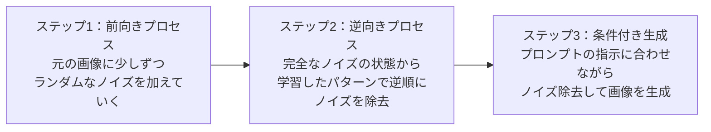
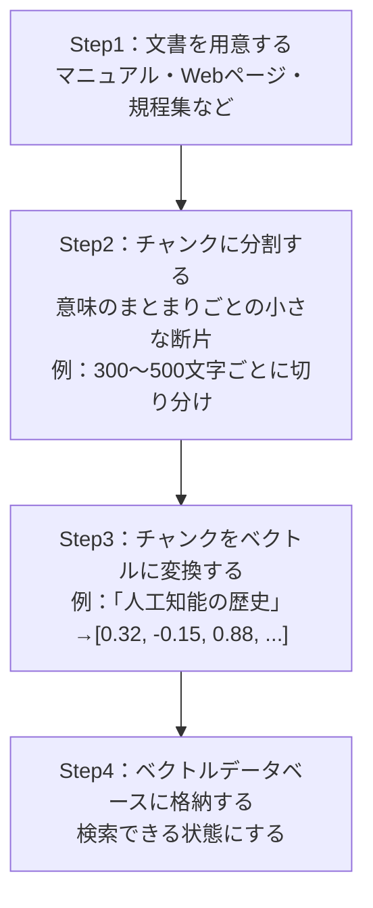
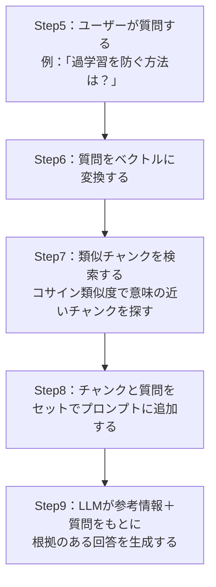
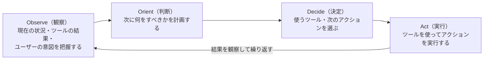

# Lesson-05：現在の生成AIの動向（ディープフェイク・RAG・AIエージェント）

> **対象章**: 第3章

---

## 復習クイズ（Lesson-04）

1. RLHF とは何の略で、どんな役割をするか？
2. ハルシネーションとは何か？どんな問題が起きるか？
3. Gemini・Claude・Copilot それぞれを開発した会社と主な特徴は何か？

---

## 1. 生成 AI の種類と主なサービス

生成 AI は扱うデータの種類（**モダリティ**）によって分類される。

> **モダリティ**：データの種類・形態のこと。「テキストのモダリティ」「画像のモダリティ」のように使う。

### テキスト生成 AI

- 自然言語処理（NLP）と機械学習で文章を自動生成する
- 翻訳・要約・文章校正・メール作成など幅広く活用できる

| サービス | 開発会社 | 特徴 |
|---------|---------|------|
| ChatGPT | OpenAI | 汎用性が高く、対話・コード生成・翻訳などに対応 |
| Gemini | Google | 検索との連携が強い。マルチモーダル設計 |
| Claude | Anthropic | 安全性・長文処理に優れる |
| Copilot | Microsoft | Office ソフト・Windows に組み込まれている |

### 画像生成 AI

コンピュータが画像を生成する技術。主な手法として以下がある。

| 手法 | 概要 | 代表例 |
|------|------|--------|
| GAN | 生成器と識別器が競い合い高品質な画像を生成 | StyleGAN |
| VAE | エンコーダとデコーダで画像を圧縮・再生成 | ー |
| CNN | 画像の特徴抽出に用いられる | ー |
| **拡散モデル（Diffusion Models）** | ノイズを少しずつ除去して画像を生成。現在の主流 | Stable Diffusion・Midjourney・DALL-E |

**拡散モデルのしくみ**

> イメージ：砂嵐（ノイズ）から少しずつ絵を浮かび上がらせるイメージ。「猫が公園で遊んでいる絵を描いて」と指示すると、砂嵐から猫の絵が現れる。

**学習データの前処理で重要なキーワード**

| 処理 | 内容 |
|------|------|
| **リサイズ** | 画像のサイズをそろえる（例：すべて 224×224 ピクセルに統一） |
| **正規化** | 画素値の数値範囲をそろえ、学習を安定させる（0〜255 を 0〜1 に変換など） |
| **データ拡張（augmentation）** | 回転・反転・切り取りなどで学習データを人工的に増やす |
| **リマスタリング** | 古い画像や映像を AI で高解像度・高品質に再生成する技術 |

### 音楽生成 AI

- AI が既存の音楽データセット（MIDI ファイルなど）から学習し、音楽を生成する
- シーケンスデータの処理に長けた **RNN** などを使って学習する
- プロンプトで「ジャズ風の 30 秒の BGM を作って」と指定できるサービスも登場している
- 代表例：Suno（テキストから音楽生成）・Udio（高品質な音楽生成）

### 音声生成 AI

- 大量の音声データを使ってディープラーニングモデルを訓練する
- 主に**教師あり学習**を用いる
- **音声クローン**：特定の人物の声の特徴を学習し、その声で任意の文章を読み上げる技術

**音声クローンの悪用リスク**

- 親の声を模倣して子どもを騙す詐欺
- 著名人の声を無断で商業利用する著作権侵害
- 政治家の偽の発言音声を作ってフェイクニュースに使う

### 動画生成 AI

- 静止画（フレーム）を連続的に生成・結合して動画を作る技術
- 大量の動画データをフレームごとに分割して学習
- 各フレーム間の**一貫性**（キャラクターの見た目・照明・動き）を保つことが最大の技術的課題

| サービス | 開発会社 | 特徴 |
|---------|---------|------|
| Sora | OpenAI | 最大 1 分間の高品質動画を生成できる |
| Veo3 | Google | 音声付きの動画を生成できる |
| Runway | Runway AI | 動画の編集・拡張・生成に対応 |

---

## 2. 生成 AI のメリットとデメリット

### メリット

| メリット | 内容 |
|---------|------|
| 作業効率の向上 | 短時間で大量のコンテンツを作成・作業の自動化が可能 |
| 補完と拡張 | 与えられた情報を基に関連情報を補完・拡張できる |
| アイデア生成 | 既存コンテンツから新しいデザインやアイデアを生み出す |
| アクセシビリティ向上 | 専門知識がなくても音楽・画像・動画を作れる |
| 言語の壁を超える | 異なる言語のコンテンツを扱える |

### デメリット

| デメリット | 内容 |
|-----------|------|
| ハルシネーション | 事実と異なる情報を生成する。**ファクトチェック**（情報の正確性を確認する作業）が不可欠 |
| 偏見・差別 | 学習データの偏りが問題あるコンテンツを生む可能性がある |
| 権利侵害 | 知的財産権等を侵害する可能性がある |
| 業界への影響 | 人間が制作したコンテンツの需要が減少する恐れ |
| 品質の問題 | 人間の制作物より品質が劣る場合がある |

> **ファクトチェック**：AI の回答に含まれる情報が正確かどうかを、一次情報源（公式サイト・学術論文・政府発表など）で確認すること。

---

## 3. ディープフェイク（深層偽造）

### ディープフェイクとは

**ディープフェイク（Deepfake）** は「深層偽造」と訳される。生成 AI を利用して、非常にリアルな偽の画像・動画・音声を作り、人を意図的にだますために使われる技術・コンテンツのことである。

「ディープ（Deep）」はディープラーニング、「フェイク（Fake）」は偽物を意味する。

**技術的な背景**

かつては動画や音声を改ざんするには、専門的な映像技術・機材・数週間の作業が必要だった。しかし現在は、スマートフォンで数分もあればリアルな偽動画を作れるアプリが存在するまでになっている。これが問題を深刻にしている。

### ディープフェイクが引き起こす社会問題

**ディスインフォメーション（Disinformation）の拡散**

- 事実に反する情報を**意図的に**広め、社会を混乱させる行為
- ミスインフォメーション（悪意なく誤情報を広める）とは区別される

> ディスインフォメーション：「わかっていて嘘をつく」
> ミスインフォメーション：「知らずに嘘を広める」

**具体的な被害事例**

| 事例 | 内容 |
|------|------|
| 政治家の偽動画 | 選挙中に実際には言っていない発言をしているように見える動画を拡散 |
| 著名人の詐欺広告 | 有名人になりすました偽の投資広告動画で金銭詐取 |
| 音声クローン詐欺 | 家族の声を模倣して「事故を起こした、今すぐ振り込んで」と騙す |
| ビジネスメール詐欺 | 上司の顔・声を使ったビデオ通話で不正送金を指示 |
| 名誉棄損 | 存在しない不適切な映像を作成して個人の評判を傷つける |

### ディープフェイクへの対策

| 対策 | 内容 |
|------|------|
| **電子透かし（デジタルウォーターマーク）** | AI が生成したコンテンツに人間の目には見えない識別マークを埋め込む技術 |
| **来歴情報の付与（C2PA）** | 画像・動画の「誰が・いつ・どこで作ったか」を記録する標準規格 |
| **AIリテラシー教育** | 偽情報を見抜く力を育てる教育 |
| **プラットフォームの対策** | SNS などがディープフェイクを検出して削除・警告ラベルを付ける |

---

## 4. RAG（検索拡張生成）

### LLM だけでは何が足りないのか

**LLM 単体の弱点**

- 学習時点より後の情報を知らない（例：2024 年以降のニュースを知らない）
- 社内専用の情報（業務マニュアル・顧客データ）を知らない
- ハルシネーションを起こすことがある

### RAG とは

**RAG（Retrieval-Augmented Generation：検索拡張生成）** は、LLM（大規模言語モデル）の弱点を補う仕組みである。

「外部の知識ベースから関連情報を検索し、プロンプトに加えて回答を生成する」という方法で弱点を解決する。

> 名前の意味：Retrieval（検索）＋ Augmented（拡張された）＋ Generation（生成）

### RAG の仕組みをステップで理解する

**事前準備（インデックス作成）**

**質問応答時（検索＋生成）**

**重要用語の整理**

| 用語 | 意味 |
|------|------|
| **チャンク** | 長い文書を意味のあるまとまりで小さく分けた断片 |
| **ベクトル** | データを数値の配列に変換したもの。意味の近さを計算できる |
| **ベクトルデータベース** | データをベクトルで格納し、類似性で検索するためのデータベース |
| **コサイン類似度** | 2 つのベクトルがどれだけ似ているかを計算する方法（0〜1 の値） |

### RAG のメリット

- 最新情報や社内固有の情報に基づいた回答ができる
- ハルシネーションを抑え、回答の根拠（出典）を示しやすい
- モデルを再学習しなくても、知識ベースを更新するだけで対応できる（コスト削減）

### RAG の活用場面

| 場面 | 具体例 |
|------|--------|
| 社内ナレッジ検索 | 規程・マニュアル・議事録の横断検索 |
| カスタマーサポート | FAQ に基づく自動応答 |
| 専門文書の Q&A | 法務・医療・金融分野の専門的な質問応答 |
| 教育 | 教科書の内容に基づいた質問応答システム |

---

## 5. AI エージェント

### AI エージェントとは

**AI エージェント**とは、目標を与えると、自ら計画を立て、複数のステップやツールを使いながら**自律的に**タスクを遂行する AI である。

**従来のチャット AI との違い**

| 比較 | チャット AI | AI エージェント |
|------|-----------|--------------|
| 動作方法 | 質問に答えるだけ（1 往復） | 「考えて→動いて→確認して→次を決める」を繰り返す |
| ツール利用 | できない | Web 検索・コード実行・ファイル操作など自律的に使い分ける |
| タスクの複雑さ | 単純な質問応答 | 複数ステップの複雑なタスクを自律で完遂 |
| 人間の関与 | 毎回人間が指示する | 目標だけ与えれば自律的に動く |

**AI エージェントの動作モデル（OODA ループ）**

**具体的な例：「来週の旅行を計画して」という指示**

1. Web 検索で目的地の情報を調べる
2. ホテル予約サイトで空室を確認する
3. 交通機関の料金を比較する
4. カレンダーに予定を登録する
5. 旅行日程をまとめたドキュメントを作成する

→ すべてを自律的に行う

### 代表的な AI エージェントツール

| ツール | 特徴 |
|--------|------|
| **GenSpark** | 調査やタスク実行を自動で行うエージェント型 AI ツール |
| **Manus** | 指示から計画立案・実行まで自動で行う自律型 AI |
| **Skywork AI** | 資料作成などの業務を支援する AI エージェント |
| **OpenAI Operator** | Web サイトを自動で操作するブラウザ操作型エージェント |

### MCP と外部連携

**MCP（Model Context Protocol）** は、AI モデルと外部のデータソース・ツールを標準化された方法でつなぐオープンな規格（プロトコル）である。2024 年に Anthropic が提唱した。

**なぜ MCP が必要か？**

AI エージェントが様々なツール（ファイルシステム・データベース・Web API・業務アプリなど）と連携するには、従来はそれぞれに専用のコードを書く必要があった。MCP はこれを統一した方法でつなぐ「共通規格」として機能する。

> たとえ話：MCP は「AI の USB-C ポート」のようなもの。USB-C が様々な機器を同じコネクタでつなぐ共通規格であるように、MCP は AI と外部ツールをつなぐ共通規格。これにより、AI エージェントが多様なツールと安全かつ容易に連携できるようになる。

---

## 授業のまとめ

| キーワード | 意味 |
|-----------|------|
| モダリティ | データの種類（テキスト・画像・音声・動画） |
| 拡散モデル | ノイズを除去して画像を生成する現在の主流手法（Stable Diffusion など） |
| リサイズ・正規化・データ拡張 | 画像学習データの前処理三種 |
| リマスタリング | AI で古い画像・映像を高品質に再生成 |
| ディープフェイク | 生成 AI で作られたリアルな偽コンテンツ |
| ディスインフォメーション | 意図的に拡散される偽情報（ミスインフォメーションと区別） |
| ファクトチェック | 情報の正確性を一次情報源で確認する作業 |
| 電子透かし | AI 生成物に埋め込む不可視の識別マーク |
| RAG | 外部知識を検索してプロンプトに加える仕組み |
| チャンク | 文書を意味のまとまりで分けた小さな断片 |
| ベクトル | データを数値配列に変換したもの |
| ベクトルデータベース | ベクトルで格納し類似性で検索する DB |
| AI エージェント | 自律的に計画・実行・確認を繰り返す AI |
| MCP | AI と外部ツールをつなぐ共通プロトコル（Anthropic が提唱） |

---

## 演習：RAG の流れを確認しよう

RAG の手順を正しい順に並べ替えよう。

A. LLM がプロンプトに追加されたチャンクをもとに回答を生成する
B. ユーザーの質問をベクトルに変換する
C. 文書をチャンクに分割する
D. チャンクをベクトルに変換してデータベースに格納する
E. ベクトルデータベースから類似チャンクを検索する
F. チャンクと質問を合わせてプロンプトを作成する

（正しい順：C → D → B → E → F → A）
