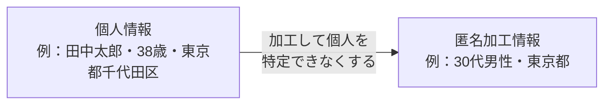

# Lesson-06：情報リテラシーと権利関係（個人情報・知的財産・各種権利）

> **対象章**: 第4章（前半）

---

## 復習クイズ（Lesson-05）

1. RAG とは何の略か、また何のために使うか説明せよ。
2. ディープフェイクとは何か？具体的な被害事例を 1 つ挙げよ。
3. AI エージェントと従来のチャット AI の違いは何か？

---

## 1. インターネットリテラシーとは

**インターネットリテラシー** とは、インターネットに関わるテクノロジー・ルール・脅威を理解し、適切に利用できる知識や能力のことである。

### インターネットリテラシーの 4 つの要素

| 要素 | 内容 | 具体例 |
|------|------|--------|
| **テクノロジーの理解** | 時代の変化に合わせてテクノロジーを把握し続ける | AI の仕組みを理解する |
| **情報リテラシー** | 必要な情報を迅速に見つけ、評価し、活用する能力 | フェイクニュースを見抜く |
| **セキュリティとプライバシー** | データやプライバシーを外部の脅威から守る手段を理解・実践する | パスワード管理・二段階認証 |
| **デジタル市民権** | 情報に効果的にアクセス・活用・創造できる能力。他のユーザーへの配慮と倫理を持つ | 著作権を守る・誹謗中傷をしない |

---

## 2. セキュリティの脅威

### フィッシング詐欺とその仲間

詐欺者が正規の機関・サービス提供者になりすまし、ユーザーから個人情報や金融情報を不正に入手しようとする手口。連絡手段によって呼び名が変わる。

| 名称 | 方法 | 具体例 |
|------|------|--------|
| **フィッシング詐欺** | メールや偽の Web サイトを使って情報を盗む | 「Amazonアカウントが停止されました」という偽メール |
| **スミッシング** | SMS（ショートメッセージ）を使ったフィッシング | 「荷物が届いています」という偽 SMS |
| **ヴィッシング** | 電話・音声を使ったフィッシング | 「銀行の者ですが、口座が不正利用されています」という電話 |

**見抜くポイント**

- URL が本物とわずかに違う（amazon.co.jp → amaz0n.co.jp）
- 「今すぐ」「緊急」という言葉で焦らせる
- リンクの実際の飛び先が怪しいドメインになっている
- 日本語が不自然（AIの活用で改善されつつある）

### マルウェア

**マルウェア（Malware）** は悪意のあるソフトウェア（Malicious Software）の総称。

| 種類 | 内容 |
|------|------|
| **ランサムウェア** | 感染するとデータが暗号化され、解除のために身代金（ランサム）を要求される。特に危険 |
| スパイウェア | 感染したコンピュータから個人情報・パスワードを盗み出す |
| トロイの木馬 | 無害に見えるソフトに偽装して侵入し、内部から情報を盗む |
| ワーム | ネットワークを通じて自己複製しながら広がる |

**ランサムウェアの被害例**

- 2021 年：アメリカのパイプライン会社がランサムウェアに感染し、ガソリン供給が一時停止。約 440 万ドルの身代金を支払った
- 日本の病院も複数がランサムウェアの被害を受け、診療が一時停止した事例がある

**対策**

- アンチウイルスソフトウェアを常に最新状態に保つ
- OS・ソフトウェアのアップデートをすぐに適用する
- 不明なファイルや出所不明のサイトを開かない
- 重要なデータは定期的にバックアップを取る

### ソーシャルエンジニアリング攻撃

人間の心理的な弱点（信頼・恐怖・好奇心・急ぎ感など）を突いて情報を盗み出す手法。技術的な攻撃ではなく「人」を騙す点が特徴。

| 種類 | 内容 | 具体例 |
|------|------|--------|
| **スピアフィッシング** | 特定の個人・組織を標的にした精巧ななりすまし攻撃 | 上司の名前を騙って「今すぐ振り込んで」というメール |
| **ベイト攻撃** | 魅力的なコンテンツを「餌」にしてマルウェアをダウンロードさせる | 「人気ゲームの無料DLC」という名の偽ファイル |
| **ブラックメール（恐喝）** | 秘密や情報の暴露をちらつかせて金銭を要求する | 「あなたの不正行為を知っている」という脅迫メール |
| **プレテキスト** | 信頼できる虚偽のシナリオを作り、それを根拠に情報を要求する | 「IT 部門ですが、パスワードを確認させてください」 |

### 生成 AI が高度化させる脅威

- フィッシングメールの文面が自然な日本語になり、見破りにくくなっている
- ディープフェイクや音声クローンを使ったなりすまし詐欺が増えている
- 本物そっくりの偽サイトや偽情報を大量かつ容易に生成できる
- スピアフィッシングにターゲットの個人情報を組み合わせ、より巧妙になっている

---

## 3. 個人情報の保護

### 個人情報保護法とは

個人情報保護法（正式名称「**個人情報の保護に関する法律**」）は、個人情報の有用性に配慮しつつ、個人の権利利益を保護することを目的とする法律。**個人情報保護委員会** が監督・指導を担う。

### 重要な用語

**個人情報**

- 生存する個人に関する情報で、その情報から特定の個人を識別できるもの
- 例：氏名・住所・生年月日・メールアドレス・顔写真

**個人識別符号**

- 単体で個人を識別できる符号
- 例：マイナンバー・運転免許証番号・旅券番号・指紋データ・顔認証データ
- 個人識別符号が含まれるものも個人情報に該当する

**要配慮個人情報**

- 取り扱いに特に配慮を要する個人情報
- 含まれるもの：人種・信条・社会的身分・病歴・犯罪歴・身体障害・精神障害など
- 収集・利用には原則として事前に**本人の明示的同意**が必要
- 生成 AI に入力する際は特に注意が必要

**機微（センシティブ）情報**

- 差別や不利益につながりうる、特に慎重な取り扱いが必要な情報の一般的な呼称
- 日本の法律上は「要配慮個人情報」に対応する

**匿名加工情報**

- 特定の個人を識別できないよう加工し、**復元できないようにした情報**
- 統計データや AI 学習データとして活用しやすくなる
- 例：「田中太郎・38歳・東京都千代田区」→「30代男性・東京都」（個人を特定できなくなる）
- **マスキング**（個人情報の一部を黒塗り・伏字にする）も同様の目的で使われる

**個人情報取扱事業者**

- 個人情報データベースを事業に用いる者（国の機関を除く）
- 個人情報の適切な収集・利用・保管・開示・廃棄の義務を負う

### 生成 AI と個人情報

生成 AI にプロンプトを入力する際の注意点：

| 注意点 | 内容 |
|--------|------|
| 最小化の原則 | 個人情報は目的を達成するために必要な最小限の範囲にとどめる |
| 目的外利用の禁止 | 個人情報を目的外に使用しない（使用する場合は本人の同意が必要） |
| 漏洩リスクの認識 | 生成 AI への入力内容が外部に漏れたり学習に使われるリスクがある点に注意する |
| 要配慮情報は入力しない | 病歴・人種などは生成 AI に入力しない |

---

## 4. 知的財産権

**知的財産権**とは、人間の知的活動によって生み出された財産的価値のあるものに与えられる法的権利の総称。

### 4 種類の知的財産権

| 権利の種類 | 何を守る | 登録 | 存続期間 |
|-----------|---------|------|---------|
| **著作権** | 小説・音楽・絵・プログラムなどの創作物 | 不要（自動発生） | 作者の死後 70 年 |
| **特許権** | 発明（高度な技術的思想の創作） | 特許庁に出願必要 | 出願日から 20 年 |
| **意匠権** | 物品・建築物・内装のデザイン・外観 | 特許庁に出願必要 | 出願日から 25 年 |
| **商標権** | ロゴ・ブランド名などの識別マーク | 登録手続き必要 | 設定登録から 10 年（更新可） |

### 各権利の詳細

**著作権**

- 登録不要で、**作った瞬間に自動的に発生**する
- プログラムのソースコードも著作物として保護される
- 対象：小説・映画・音楽・絵画・写真・コンピュータプログラムなど
- 著作権者は「複製権・公衆送信権・翻訳権」などの様々な権利を持つ
- 死後 70 年で保護期間が終わり、誰でも自由に使えるようになる（パブリックドメイン）

**特許権**

- 「発明」（自然法則を利用した技術的創作のうち高度なもの）を保護
- 出願して審査を通った場合のみ権利が発生する
- 保護期間中は発明の内容を独占的に利用できる
- 例：スマートフォンの通信技術・新薬の製造方法

**意匠権**

- 物品のデザイン・外観の美しさ・斬新さを保護する
- 形状・模様・色彩などの「見た目」が対象
- 例：スマートフォンの外観デザイン・家具のデザイン

**商標権**

- 商品やサービスを区別するためのマーク・名称を保護する
- 10 年ごとに更新可能で、使い続ける限り保護が続く
- 例：ナイキのスウッシュマーク・コカ・コーラのロゴ

### 著作権侵害

既存の著作物を **依拠**（参考にする）し、それと **類似** した表現を無断で利用・複製・公開すると著作権侵害になりうる。

生成 AI を使う際の注意点：

- 生成 AI の出力が既存著作物に酷似している場合は注意が必要
- 他人の著作物をそのまま AI に学習させて似たものを生成することは問題になりうる
- 生成した画像・文章を使う前に著作権侵害がないか確認することが重要

---

## 5. 肖像権・パブリシティ権と AI 生成物

### 肖像権

**肖像権**：自分の顔・姿（肖像）を自ら管理できる権利。他人に無断で撮影・使用・公表されない権利。

- 有名人でも一般人でも持つ権利
- 生成 AI で実在する人物の顔を生成する際は肖像権の侵害になりうる

### パブリシティ権

**パブリシティ権**：著名人が自らの肖像などから得られる **経済的価値** を排他的に利用できる権利。

- 例：有名スポーツ選手の顔写真を無断で商品に使う → パブリシティ権侵害
- AI で著名人の声を無断でコピーして商業利用する → パブリシティ権・著作権の侵害

### AI 生成物と著作権（文化庁 2025 年 2 月の見解）

2025 年 2 月、文化庁は AI 生成物の著作権について以下の見解を示した。

| ケース | 著作物にあたるか |
|--------|----------------|
| **人間が AI を「道具」として使い、創作的に関与した場合** | **著作物にあたる** |
| **AI の出力を人間が発展・改変させた場合** | **著作物にあたる** |
| AI が自律的に生成し、人間の創作的関与がない場合 | 著作物にあたらない |

**重要なポイント**：「AI が勝手に作った」場合は著作物にならないが、「人間が AI を道具として使って作った」場合は著作物になりうる。

---

## 6. 不正競争防止法

**不正競争防止法**は、事業者間の公正な競争を守るための法律。生成 AI 利用時に特に注意すべき点：

### 営業秘密

- **営業秘密** を生成 AI に入力しない（入力内容が外部に漏れる・学習に使われるリスクがある）
- 営業秘密の **3 要素**：

| 要素 | 内容 | 例 |
|------|------|-----|
| **秘密管理性** | 秘密として管理されていること | パスワードで保護・「社外秘」の表示 |
| **有用性** | 事業活動に有用な情報であること | 顧客リスト・製造方法 |
| **非公知性** | 一般に知られていないこと | 公開されていない社内情報 |

### 限定提供データ

- 特定の人のみに提供されるデータを不正に取得・使用・開示しない
- 限定提供データの **3 要素**：限定提供性・相当蓄積性・電磁的管理性

### 技術的制限手段の回避

- コピーガードなどを突破する行為（例：ゲームの DRM を解除する）は不正競争防止法違反になりうる

---

## 授業のまとめ

| キーワード | 意味 |
|-----------|------|
| フィッシング詐欺 | 偽サイト・メールで情報を騙し取る |
| スミッシング / ヴィッシング | SMS / 電話を使ったフィッシング |
| マルウェア・ランサムウェア | 悪意ある不正ソフト / 暗号化して身代金を要求 |
| ソーシャルエンジニアリング | 人の心理を突いて情報を盗む手法 |
| 個人情報保護委員会 | 個人情報保護法の監督機関 |
| 個人識別符号 | 単体で個人を識別できる符号（マイナンバーなど） |
| 要配慮個人情報 | 病歴・人種など特に慎重な取り扱いが必要な個人情報 |
| 匿名加工情報 | 個人を特定できないよう加工し復元不可にした情報 |
| 著作権 | 創作物を守る権利（登録不要・自動発生、死後 70 年） |
| 特許権 | 発明を守る権利（出願必要、出願から 20 年） |
| 意匠権 | デザインを守る権利（出願必要、出願から 25 年） |
| 商標権 | ブランド名・ロゴを守る権利（10 年、更新可） |
| 肖像権 | 自分の顔・姿を管理する権利（誰もが持つ） |
| パブリシティ権 | 著名人が肖像の経済的価値を守る権利 |
| 文化庁見解 | 人間が創作的に関与した AI 生成物は著作物にあたる（自律的生成のみはあたらない） |
| 営業秘密の 3 要素 | 秘密管理性・有用性・非公知性 |

---

## 演習：権利の種類を分類しよう

次のケースは何の権利に関係するか。当てはまる権利名を答えよ。

1. ゲーム会社が独自のキャラクターのデザインを保護したい
2. 薬品会社が新しく開発した薬の製造方法を保護したい
3. コーヒーチェーンが自社のロゴマークを保護したい
4. 小説家が自分の書いた作品を保護したい
5. 有名アイドルの顔を無断で商品に使った場合、侵害される権利は何か

（解答：1→著作権・意匠権　2→特許権　3→商標権　4→著作権　5→肖像権・パブリシティ権）
