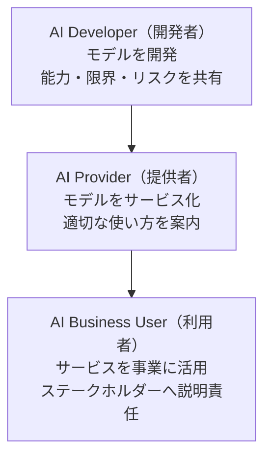

# Lesson-07：AI倫理・法規制（AI社会原則・ガイドライン・AI新法）

> **対象章**: 第4章（後半）

---

## 復習クイズ（Lesson-06）

1. 要配慮個人情報とは何か？具体例を 2 つあげよ。
2. 著作権・特許権・意匠権・商標権の違いを一言で説明せよ。
3. 文化庁の見解によると、AI 自律生成物は著作物にあたるか？人間が AI を道具として使った場合は？

---

## 1. 人間中心の AI 社会原則とは

2019 年 3 月、日本の **統合イノベーション戦略推進会議** で決定された「**人間中心の AI 社会原則**」が内閣府から発表された。

AI が目指すべき社会像と、各主体が取り組むべき事項を「基本理念 → AI 社会原則 → 共通の指針」というピラミッド構造で示している。

**なぜ AI 社会原則が必要なのか？**

AI は非常に強力な技術であり、使い方によっては人権侵害・差別・プライバシー侵害などの問題を引き起こす可能性がある。技術だけが先行して社会ルールが追いつかないと、人々が傷つくことになる。そのため、「AI をどのように作り、使うべきか」という共通のルールが必要とされた。

---

## 2. 基本理念の 3 つの柱

### Dignity（人間の尊厳）

人間が AI を道具として使いこなすことで能力を発揮できるようにし、物質的・精神的に豊かな生活が送れる社会を目指す。

> AI はあくまでも「人間を助けるための道具」であるという考え方。

**具体的な意味**

- AI が人間の仕事をすべて奪ったり、人間を道具のように扱うことがあってはならない
- AI の判断によって人間の尊厳が傷つけられることがあってはならない
- 採用選考・融資審査・医療診断など、人の人生に関わる判断を AI が一方的に行うことへの慎重さが求められる

**例え話**：人間が使う「道具」は、包丁でも車でも、「人間が目的を持って使う」ものである。AI も同じで、AI に人間が支配されるのではなく、人間が AI を目的を持って使いこなすことが Dignity の精神。

### Diversity & Inclusion（多様性と包摂）

さまざまな背景・価値観・考え方をもつ人々が多様な幸せを追求し、新たな価値を創造できる社会が理想。AI はそのための有力な道具の一つ。

> 誰一人取り残さない社会をつくるために AI を活用する。

**具体的な意味**

- AI の設計・開発に多様な人々の視点を反映する（性別・年齢・国籍・障害の有無など）
- AI がある特定のグループに不当な差別や不利益をもたらさないようにする
- 言語・身体機能・経済状況に関わらず、誰でも AI の恩恵を受けられるようにする

**例え話**：翻訳 AI が日本語・英語・スペイン語だけでなく、マイノリティが使う言語にも対応することで、より多くの人が情報にアクセスできるようになる。

### Sustainability（持続可能性）

社会の格差を解消し、地球規模の環境問題・気候変動にも対応できる持続可能な社会を構築する。

**具体的な意味**

- AI の開発・運用には膨大な電力を消費する（データセンターの電力問題）
- AI の恩恵が一部の先進国・富裕層だけに集中しないようにする
- AI が環境問題の解決（気候変動対策・エネルギー効率化）に貢献できるよう活用する

---

## 3. AI 社会原則（10 項目）

基本理念を実現するために、各主体が取り組む具体的な原則。

| 番号 | 原則 | 内容 |
|------|------|------|
| 1 | **人間中心** | 人権を侵害せず、人間の能力を拡張し、多様な幸せを追求できる形での活用を目指す |
| 2 | **安全性** | 生命・身体・財産・精神・環境に危害を及ぼさないよう十分なリスク対策を講じる |
| 3 | **公平性** | 人種や性別などによる不当な差別をなくし、AI のバイアスを評価・軽減する |
| 4 | **プライバシー保護** | 個人情報保護法等の法令を遵守し、プライバシーを尊重する |
| 5 | **セキュリティ確保** | 意図しない変更や停止が起きないよう合理的な対策を行う |
| 6 | **透明性** | 検証可能性を確保し、ステークホルダーへ合理的な範囲で情報提供を行う |
| 7 | **アカウンタビリティ** | トレーサビリティ（追跡可能性）の向上と責任者の明示、説明責任を果たす |
| 8 | **教育・リテラシー** | 関係者への教育・リスキリングを支援する |
| 9 | **公正競争確保** | 公正な競争環境の維持に努める |
| 10 | **イノベーション** | オープンイノベーションの推進と相互運用性の確保に貢献する |

### 特に重要な原則を深掘り

**公平性（バイアス問題）**

AI が「差別」をしてしまう問題は実際に起きている。

- 過去の採用データで学習した AI が、女性を不採用にする傾向を持ってしまった事例
- 顔認識 AI が黒人の顔を誤認識する精度が白人より低かった事例

これらはすべて「学習データの偏り」が原因。学習データに人間の偏見が反映されると、AI もその偏見を学んでしまう。

**透明性とアカウンタビリティ**

- 透明性：「この AI がどのような基準で判断しているか」を関係者が確認できること
- アカウンタビリティ（説明責任）：AI の判断について「なぜそう判断したか」を説明できること

例：融資審査 AI が「この人には貸せない」と判断した場合、銀行は「なぜか」を説明できなければならない。

---

## 4. AI 事業者ガイドライン

AI に関わる事業者が守るべき指針をまとめたもの。AI に関わる主体を 3 つに分類している。

### 3 つの主体

**AI Developer（AI 開発者）**

AI システムを構築・開発する主体。GPT モデルを作る OpenAI のような企業が該当。

主な責務：

| 責務 | 内容 |
|------|------|
| **適正な学習** | データの適正な収集・知的財産権への留意・データの質の管理 |
| **開発時の安全配慮** | ガードレール技術の検討・予期しない環境での性能確認 |
| **情報の提供** | AI の能力・限界・予見可能なリスクを AI 提供者へ共有 |

**AI Provider（AI 提供者）**

AI をサービスとして提供する主体。ChatGPT を API で提供する企業・独自の AI チャットボットをサービスとして提供する企業が該当。

主な責務：

| 責務 | 内容 |
|------|------|
| **リスク対策の実装** | システム実装時の安全性確保・ガードレール技術の導入 |
| **適正利用の促進** | 利用上の留意点を定め、利用者が正しく使えるよう注意喚起・サポート |
| **脆弱性への対応** | 最新の攻撃手法の動向を確認し対応 |

**AI Business User（AI 利用者）**

事業活動で AI を利用する主体。会社の業務で ChatGPT を使う企業・個人が該当。

主な責務：

| 責務 | 内容 |
|------|------|
| **安全な適正利用** | 提供者が定めた留意点を遵守し、設計想定の範囲内で利用 |
| **入力データの管理** | プロンプトに機密情報・個人情報を不適切に含めない |
| **ステークホルダーへの説明** | AI を利用していることの通知・AI の判断を用いた際の説明責任 |

### 3 主体の関係図

### AI ガバナンス

AI を適切に管理・監督するための組織体制・プロセスの整備を **AI ガバナンス** という。

> 例え話：学校の生徒会が「文化祭のルール」を決め、守らせる仕組みのように、AI を使う組織全体でどのようにルールを守り、問題が起きたときに誰が責任をとるかを決めておく仕組み。

**AI ガバナンスが必要な理由**

- AI の利用が増えるほど、問題が起きたときの「誰の責任か」が不明確になりやすい
- 内部のルール整備・監査・インシデント対応を組織的に行う必要がある

### 高度な AI に関する追加対応

最先端の AI システムを扱う事業者には、**広島 AI プロセス** の国際指針を踏まえた追加対応が求められる：

- **市場投入前後のリスク評価**：外部テスト（レッドチーム等）・導入後のモニタリング
- **コンテンツの識別**：**電子透かし** などを導入し、AI 生成物であることを識別できるように努める
- **情報の共有**：セキュリティリスク・インシデントに関する情報を組織間で共有する

---

## 5. AI 新法（2025 年 6 月交付）

### AI 新法とは

正式名称：**「人工知能関連技術の研究開発及び活用の推進に関する法律」**

2025 年 6 月に公布（交付）された、**日本初の AI を対象とした包括的な法律**。

「AI 新法」という通称で呼ばれることが多い。

### AI 新法が生まれた背景

- 生成 AI の急速な普及により、フェイク情報・個人情報漏洩・雇用問題などの社会問題が顕在化
- EU が 2024 年に世界初の包括的な AI 規制法（EU AI Act）を成立させ、国際的な潮流が生まれた
- 日本も自主的なガイドラインだけでは不十分で、法律による枠組みが必要とされた

### AI 新法の目的

AI 技術の研究開発と活用を社会全体で安全・安心に推進しながら、日本のイノベーション競争力を高めることを目的とする。

安全性・信頼性の確保とイノベーション推進のバランスをとることが基本姿勢。

### AI 新法の主な内容

**1. 基本理念**

- 人間の尊厳・多様性・持続可能性の確保（AI 社会原則と連携）
- 国民の安全・安心の確保とイノベーション推進のバランス

**2. リスクベースアプローチ**

AI のリスクの程度に応じて求められる対応が変わる考え方。

| リスクレベル | 対象 AI | 求められる対応 |
|------------|--------|-------------|
| 高リスク AI | 採用選考・融資審査・行政処分など人の生活に大きく影響する AI | 透明性の確保・人間による監督・説明義務 |
| 中リスク AI | 一般的な業務支援 AI | 適切な情報開示 |
| 低リスク AI | 単純な自動化・チャットボットなど | 自主的な取り組み |

**3. 国・事業者の役割**

- 国は AI の普及・利活用環境を整備する
- 事業者は安全性・信頼性を確保した AI の開発・提供を行う
- 利用者の権利保護に配慮する

**4. AI 事業者ガイドラインとの関連**

AI 事業者ガイドラインで示されてきた自主的な取り組みが、法律上の枠組みとして位置付けられた形。AI 開発者・提供者・利用者の 3 主体それぞれに対する責任が法的に明確化された。

---

## AI 倫理のポイントまとめ

生成 AI を正しく使うために必要な考え方：

1. **AI は道具**：AI はあくまで人間を助けるツールであり、最終的な判断は人間が行う
2. **透明性**：AI をどのように使っているかを適切に開示する
3. **説明責任**：AI を使った意思決定について、関係者に説明できるようにする
4. **安全性第一**：人の生命・健康・権利に影響を与える場面では慎重に扱う
5. **公平性**：AI が差別や偏見を助長しないよう注意する

---

## 授業のまとめ

| キーワード | 意味 |
|-----------|------|
| Dignity | 人間の尊厳が尊重される社会。AI は人間を助ける道具 |
| Diversity & Inclusion | 多様な背景の人が幸せを追求できる社会。AI もそのために活用する |
| Sustainability | 持続可能な社会。環境・格差問題への貢献 |
| AI 社会原則 10 項目 | 人間中心・安全性・公平性・プライバシー・セキュリティ・透明性・アカウンタビリティ・教育・公正競争・イノベーション |
| AI Developer | AI システムを構築・開発する主体 |
| AI Provider | AI をサービスとして提供する主体 |
| AI Business User | 事業活動で AI を利用する主体 |
| AI ガバナンス | AI を適切に管理・監督するための組織体制 |
| 電子透かし | AI 生成物であることを識別するための不可視の識別マーク |
| AI 新法 | 2025 年 6 月交付の日本初の AI 包括法 |
| リスクベースアプローチ | リスクの程度に応じて求められる対応を変える考え方 |
| アカウンタビリティ | トレーサビリティの確保と説明責任 |

---

## 演習：AI を使う場面と守るべき原則を考えよう

次の場面で、AI 社会原則のうち特に大切にすべき原則はどれか。理由と一緒に考えよう。

1. 病院が AI を使って患者の治療方針を決定する場合
2. 採用担当者が AI を使って履歴書を選別する場合
3. SNS プラットフォームが AI を使って投稿を自動削除する場合
4. 学校が AI を使って生徒の成績評価を行う場合
