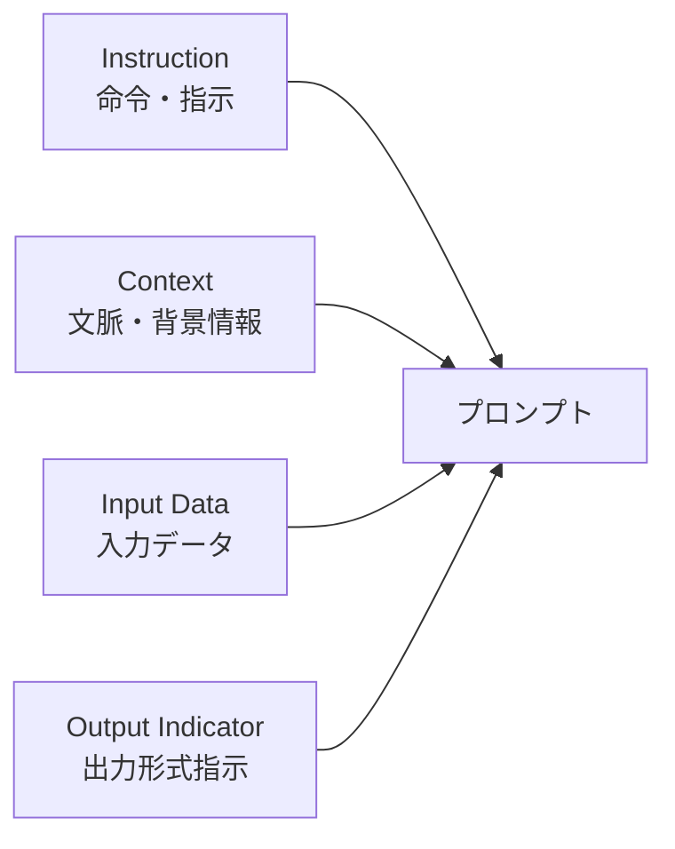

# Lesson-08：プロンプトエンジニアリング（LLM理論・Zero-Shot・Few-Shot）

> **対象章**: 第5章

---

## 復習クイズ（Lesson-07）

1. AI 社会の 3 つの基本理念を英語名と意味をセットで答えよ。
2. AI 事業者ガイドラインの 3 主体を答え、それぞれの役割を一言で説明せよ。
3. AI 新法はいつ交付されたか？リスクベースアプローチとは何か？

---

## 1. プロンプトとは

**プロンプト** とは、AI モデルに対して指示や質問を入力する文のことである。

ChatGPT や Gemini などのチャット AI を使うとき、テキストボックスに入力する文章がすべてプロンプトにあたる。プロンプトの書き方しだいで、AI の回答の質が大きく変わる。

このプロンプトを工夫して AI の出力を改善する技術が **プロンプトエンジニアリング** である。

**なぜプロンプトが重要なのか？**

- AI は「聞かれたことに答える」のではなく「プロンプトに含まれる情報を使って回答を生成する」
- 情報が少ないプロンプトには少ない情報でしか回答できない
- 具体的で明確なプロンプトほど、求める回答に近い出力が得られる

**比較例**

```
悪いプロンプト：「AI を教えて」
→ 広すぎて、何を答えればいいかわからない

良いプロンプト：「中学生にもわかるよう、AI と機械学習の違いを
具体例を使って 200 字以内で説明してください」
→ 対象・内容・制約がすべて明確
```

---

## 2. LM と LLM

### LM（Language Model：言語モデル）

- 自然言語の文章を「確率の分布」として学習したモデル
- 「次に来る単語は何か」を確率で予測する

**n-gram モデル**：直前の n 個の単語から次の単語を予測する古典的な言語モデル。

```
bigram（2-gram）の例：
「今日は」の次に来る単語の確率（過去の大量テキストから計算）
「良い」: 15%
「晴れ」: 12%
「忙しい」: 8%
「雨」: 6%
...
→ 最も確率が高い「良い」を選ぶ
```

n-gram の課題：文章が長くなると計算量が爆発的に増える。文脈を長く覚えられない。

**ニューラル言語モデル**：ニューラルネットワークを用いた現代的な言語モデル。n-gram より長い文脈を考慮できる。

### LLM（Large Language Model：大規模言語モデル）

- LM と比べて非常に大規模なデータセット（インターネット上のテキストのほぼすべて）で学習した自然言語処理モデル
- 高い精度で自然言語処理タスク（文章生成・質問応答・要約・翻訳など）をこなせる
- 代表例：ChatGPT（GPT-4 など）・Gemini・Claude

| 比較 | LM | LLM |
|------|-----|-----|
| データ規模 | 限られたデータセット | 巨大なデータセット（兆単位のトークン） |
| パラメータ数 | 数百万〜数億 | 数百億〜数兆 |
| 能力 | 特定タスクのみ | 多様な自然言語タスクに対応 |
| 代表例 | n-gram・初期の BERT | GPT-4・Gemini・Claude |

### プレトレーニング（事前学習）

- 大量のテキストデータを使って、言語の知識を幅広く学習させるプロセス
- 主に「教師なし学習」を用いる
- インターネット上の文章・書籍・Wikipedia・ニュース記事など膨大な文章から言語パターンを学ぶ

> イメージ：まず教科書を何千冊も読んで基礎知識を身につける段階。この段階では特定のタスクは考えずに、ひたすら「言語」を学ぶ。

**ファインチューニング（微調整）**

- プレトレーニング済みのモデルを、特定のタスクに合わせて追加学習させる手法
- ハイパーパラメータを調整してモデルの特性を変える

> イメージ：教養課程を終えた後に「医学部」や「法学部」に進んで専門知識を学ぶようなもの。

---

## 3. ハイパーパラメータ：Temperature と Top-p

**ハイパーパラメータ** とは、モデルの学習や出力の仕方を制御するパラメータである。自動的に学習されるパラメータ（重み）とは別に、人間が手動で設定する。

LLM では特に **Temperature** と **Top-p** の 2 つが重要。

### Temperature（温度）

生成される文章の「自由度（ランダム性）」を調整する。通常 0〜1（または 0〜2）の間で設定する。

| 設定値 | 特徴 | 活用場面 |
|--------|------|---------|
| 低い（0 に近い） | 確率が最も高い単語を選びやすく、決まった答えになりやすい | 事実確認・技術的な質問・正確な情報が必要な場面 |
| 高い（1 に近い） | 確率が低い単語も選ばれやすく、多様で予測しにくい文章になる | 詩・アイデア出し・物語・キャッチコピー |

**Temperature の仕組み（詳細）**

```
次の単語の候補と確率（Temperature = 0.2 の場合）：
「良い」: 80%（最も高い）→ほぼ必ずこれが選ばれる
「晴れ」: 15%
「最高」: 5%

次の単語の候補と確率（Temperature = 1.0 の場合）：
「良い」: 40%
「晴れ」: 30%
「最高」: 20%
「素晴らしい」: 10%  ← 低い確率の単語も選ばれやすくなる
```

### Top-p（トップ・ピー）

次の単語を選ぶ「候補の絞り込み方」を決める。0〜1 の間で設定する。

- 例：Top-p を 0.8 に設定すると、「次の単語として選ばれる確率の**上位 80% の単語の中から**」選択される
- 値を小さくすると候補が絞られ、より一貫した文章になる
- 値を大きくすると候補が広がり、多様な表現が生まれやすい

> イメージ：「いつものメニュー上位 80% の中からランダムに選ぶ」感じ。人気メニューに絞って選ぶので品質は保ちながら、少しランダム性がある。

---

## 4. プロンプトの 4 つの要素

効果的なプロンプトは次の 4 つの要素から構成される（DAIR.AI の考え方）。

すべての要素が必要なわけではなく、目的に応じて組み合わせる。最低限必要なのは「Instruction（命令）」だけだが、要素を組み合わせるほど精度が上がる。

### Instruction（命令・指示）

AI に「何をすべきか」を指示する。プロンプトで最も基本的な要素。

- 例：「次の文章を 3 点に要約して」
- 例：「このコードのバグを見つけて」
- 例：「以下の文章を英語に翻訳してください」

**より良い Instruction のコツ**：動詞で始める、具体的に指定する、曖昧な言葉を避ける

### Context（文脈・コンテキスト）

AI がタスクを実行するための背景情報・参照情報を与える。

- 例：「あなたはプロのプログラマーです」
- 例：「対象読者は小学生です」
- 例：「これは商品レビューです」

「AI の役割設定」も Context の一部として使われる（ロールプレイング）。

> なぜ Context が重要なのか？：同じ「説明して」という指示でも、「専門家向け」か「小学生向け」かで最適な回答が全く変わる。Context がないと AI は「誰に向けて書くか」がわからない。

### Input Data（入力データ）

AI に処理させる具体的な情報やデータ。

- 例：要約させたい元の長文
- 例：レビューさせたいソースコード
- 例：翻訳させたい文章

### Output Indicator（出力指示）

AI にどのような形式・構造で結果を返すか指示する。

- 例：「箇条書きで 5 点」
- 例：「マークダウン形式で」
- 例：「表にまとめて」
- 例：「200 字以内で」
- 例：「JSON 形式で出力して」

### 4 要素の組み合わせ方



### プロンプトの完全な例

```
あなたはプロのコピーライターです（Context）。
以下の商品情報をもとに（Input Data）、
中学生に向けた魅力的な紹介文を考えてください（Instruction）。
箇条書きで 3 点、各 50 字以内で出力してください（Output Indicator）。

【商品情報】
・新発売のスマートウォッチ
・心拍数・睡眠・歩数を計測
・防水・充電不要（ソーラー充電）
```

---

## 5. Zero-Shot と Few-Shot プロンプティング

### Zero-Shot プロンプティング

- 例示を **0 個（ゼロ）** で質問するプロンプティング
- AI がすでに十分な知識を持つシンプルなタスクに適している

```
Zero-Shot の例：
「"delicious" の日本語訳は？」
```

メリット：シンプルで手軽に使える。
デメリット：複雑なタスクではハルシネーションが起きやすく、信頼性が下がることがある。

### One-Shot プロンプティング

- 例示を **1 個** 与えてから質問するプロンプティング

```
One-Shot の例：
"happy" → 幸せな
"sad" → ？
```

### Few-Shot プロンプティング

- 例示を **2〜3 個** 与えてから質問するプロンプティング
- 出力の形式や方向性を誘導したいときに有効

```
Few-Shot の例：
"happy" → 幸せな
"sad" → 悲しい
"angry" → ？
```

このように例を示すことで、AI は「どんな形式で答えるべきか」を理解して回答する。

メリット：出力の形式や内容を制御しやすい。複雑なタスクの精度が向上する。
デメリット：例示を考える手間がある。

### Shot の整理

| 名称 | 例示の数 | 向いている場面 |
|------|---------|-------------|
| Zero-Shot | 0 個 | 簡単なタスク・AI が得意な分野 |
| One-Shot | 1 個 | 形式を少し誘導したいとき |
| Few-Shot | 2〜3 個 | 複雑なタスク・特定の形式や方向性を強く誘導したいとき |
| Many-Shot | 多数 | さらに細かい制御が必要なとき |

### Few-Shot が効果的な理由

AI は「パターンを見つける」のが得意である。例示を見せることで「この質問にはこのパターンで答えればいい」と AI が理解する。

```
（メール文の感情分析の例）
「素晴らしいサービスをありがとうございます！」→ ポジティブ
「対応が遅すぎる、改善してください」→ ネガティブ
「普通に使えました」→ ？

→ 「ニュートラル」という答えを AI が理解しやすくなる
```

---

## 6. 実習：AI を操作してみよう

### 実習① Zero-Shot vs Few-Shot を比較する

**課題**：感情分析（テキストからポジティブ / ネガティブを判定）

**Zero-Shot の例**：

```
次の文章の感情を「ポジティブ」または「ネガティブ」で答えてください。

「今日は最悪な一日だった。電車が遅れて、財布も忘れた。」
```

**Few-Shot の例**：

```
次の文章の感情を「ポジティブ」または「ネガティブ」で答えてください。

例1：「今日は友達と楽しく過ごせた！」→ ポジティブ
例2：「宿題が全然できない。つらい。」→ ネガティブ

「今日は最悪な一日だった。電車が遅れて、財布も忘れた。」→ ?
```

実際に両方試して、回答の質・詳しさ・形式の違いを確認してみよう。

### 実習② プロンプトの 4 要素を使う

自分で好きなテーマでプロンプトを作成し、4 要素（Instruction・Context・Input Data・Output Indicator）がそれぞれどこに対応しているかをラベルを付けて説明してみよう。

**テーマ例**

- 好きなゲームの紹介文を書いてもらう
- 学校のレポートの構成を考えてもらう
- 旅行のプランを立ててもらう

---

## 授業のまとめ

| キーワード | 意味 |
|-----------|------|
| LM | 言語モデル。次の単語を確率で予測する |
| n-gram モデル | 直前の n 個の単語から次を予測する古典的 LM |
| LLM | 大規模言語モデル。巨大なデータで学習した高精度な LM |
| プレトレーニング | 大量データで言語知識を事前学習するプロセス |
| ファインチューニング | 特定タスク向けの追加学習 |
| ハイパーパラメータ | モデルの出力を制御するパラメータ（人間が設定） |
| Temperature | 出力の自由度（ランダム性）を調整（低い→決まった答え、高い→多様な答え） |
| Top-p | 次の単語の候補を絞り込む割合（上位 p% から選択） |
| プロンプト | AI への入力文 |
| プロンプトエンジニアリング | プロンプトを工夫して AI の出力を改善する技術 |
| Instruction | プロンプトの「命令・指示」要素 |
| Context | プロンプトの「文脈・背景情報」要素（役割設定も含む） |
| Input Data | プロンプトの「入力データ」要素 |
| Output Indicator | プロンプトの「出力形式指示」要素 |
| Zero-Shot | 例示なしで直接質問するプロンプティング |
| Few-Shot | 例示 2〜3 個を示してから質問するプロンプティング |
