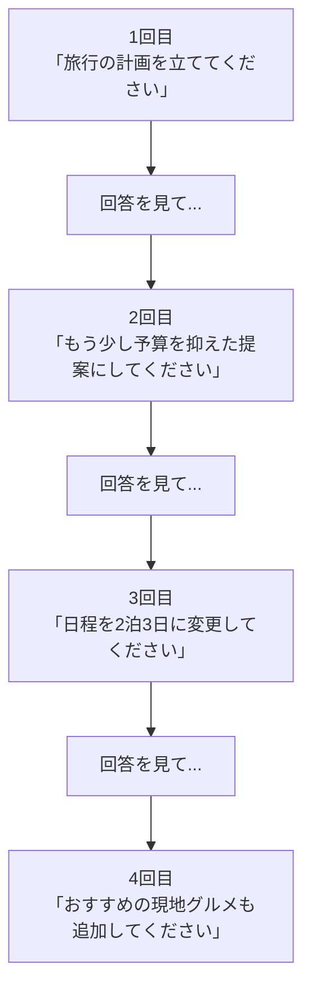

# Lesson-09：プロンプト実践演習（ビジネス応用・AIを実際に操作）

> **対象章**: 第5章（実践）

---

## 復習クイズ（Lesson-08）

1. プロンプトの 4 つの要素を英語名と役割をセットで答えよ。
2. Temperature の値が高いとどうなるか？低いとどうなるか？
3. Zero-Shot と Few-Shot の違いは何か？それぞれどんな場面に向くか？

---

## 1. 文章系プロンプト実践

この章では実際に AI に指示を入力して、出力を確認しながら学ぶ。すべてのプロンプトを実際に試してみよう。

### 校正・修正

用途：文章の誤字脱字・表現の改善をしてもらう

```
あなたは校正専門の編集者です（Context）。
以下の文章の誤字脱字と不自然な表現を修正してください（Instruction）。
修正した箇所はわかりやすく【修正前 → 修正後】の形式で示してください（Output Indicator）。

（修正したい文章をここに貼る）（Input Data）
```

**確認ポイント**

- 修正箇所が明確に示されているか？
- 内容を変えず表現だけ直しているか？
- 「なぜその修正をしたか」も聞いてみよう

### 要約

用途：長い文章を短くまとめてもらう

```
以下のニュース記事を要約してください（Instruction）。
対象は中学生です（Context）。
重要ポイントを 3 点、各項目 50 字以内の箇条書きにしてください（Output Indicator）。

（要約したい記事をここに貼る）（Input Data）
```

**改善パターンを試してみよう**

```
（追加指示の例）
→ 「もう少し専門用語を減らして、もっとわかりやすくして」
→ 「3 点を 5 点に増やして」
→ 「箇条書きではなく、1 つの段落にまとめて」
```

### 箇条書き変換

用途：段落形式の文章を読みやすい箇条書きに変換する

```
以下の文章を箇条書きに変換してください。
重要なポイントだけを残し、5点以内にまとめてください。
各項目は「・」で始めてください。

（変換したい文章をここに貼る）
```

### 話者設定（ロールプレイング）

用途：AI に特定の専門家の立場で回答させる

```
あなたは中学生向けに理科を教えるベテランの先生です（Context）。
「光合成のしくみ」を小学生でもわかるように、身近な例え話を使いながら説明してください（Instruction）。
説明は 200 字以内でまとめてください（Output Indicator）。
```

**役割設定の効果を比較してみよう**

同じ質問を「役割なし」と「役割あり」で試して、回答がどう変わるか確認しよう。

```
（役割なし）「光合成を説明して」
（役割あり）「あなたは小学生に自然のしくみを教えることが得意な先生です。光合成を説明して」
```

### 例え話の生成

用途：難しい概念を身近な例え話でわかりやすくする

```
「ニューラルネットワーク」という AI の仕組みを（Input Data）、
小学生でも理解できるような身近な例え話で説明してください（Instruction）。
例え話のみで 200 字以内にまとめてください（Output Indicator）。
```

**さらに発展させよう**

```
（追加指示）
→ 「その例え話をもとに、ディープラーニングとの違いも説明して」
→ 「例え話をスポーツに置き換えて説明して」
```

---

## 2. ビジネス応用プロンプト実践

### メール作成

```
以下の条件でビジネスメールを作成してください（Instruction）。

・送信先：株式会社山田商事の田中部長
・用件：先日の打ち合わせのお礼と、次回の日程調整のお願い
・候補日：来週月曜日または水曜日の午後 14〜17 時
・トーン：丁寧・ビジネスライク（Input Data）

件名と本文を分けて出力してください（Output Indicator）。
```

**確認ポイント**

- 件名は適切か？
- 敬語は正しく使われているか？
- 用件が明確に伝わっているか？

### アンケート項目の作成

```
あなたはマーケティング担当者です（Context）。
以下のテーマでアンケートを作成してください（Instruction）。

テーマ：「学校の AI 活用についての生徒の意識調査」
対象：中学生
項目数：5問
形式：5段階評価（1〜5）と選択肢形式を組み合わせる（Input Data）

各問に簡単な説明を付けて出力してください（Output Indicator）。
```

### ブレインストーミング

用途：アイデアをたくさん出してもらう

```
「学校内での生成 AI の活用アイデア」を（Input Data）
10 個、箇条書きで出してください（Instruction）。
実現しやすいものから難しいものまで、幅広く考えてください（Output Indicator）。
```

**ブレインストーミングのコツ**

AI のアイデアは「出発点」として使う。「この中で面白いものを 3 つ選んで深掘りして」と追加指示を出すことで、アイデアが具体的になる。

### タスク分解

用途：大きなタスクを小さなステップに分けてもらう

```
「来週の文化祭の準備」を担当することになりました（Input Data）。
今日から 5 日間でやるべきことをタスク一覧にして（Instruction）、
優先順位と担当者（一人でやるか複数人でやるか）も添えて整理してください（Output Indicator）。
```

### 翻訳と文化的調整

```
以下の日本語を自然な英語に翻訳してください（Instruction）。
相手はアメリカの同年代の中学生です（Context）。

「今日は学校で AI についての授業があって、生成 AI パスポートの試験について学んだよ。
すごく面白かった！将来は AI を使った仕事をしてみたいな。」（Input Data）

翻訳後に「日本語と英語の表現の違い」があればコメントも付けてください（Output Indicator）。
```

---

## 3. テキスト生成 AI の不得意なこと

以下の項目は、テキスト生成 AI が苦手とする作業である。実際に試して確認してみよう。

### 複雑な計算

```
127 × 89 - 3456 ÷ 48 を計算してください。途中の計算式も示してください。
```

確認：計算ミスが起きやすい。特に複数ステップの計算は要注意。

→ 計算専用のツール（電卓・Python など）を使う方が確実。AI は「計算を検証する説明」には使えても、正確な計算自体には向かない。

### 最新情報

```
今日の東京の天気を教えてください。今日の日付も教えてください。
```

確認：AI は学習データのカットオフ以降の情報を知らない。

→ 最新情報は公式サイト・検索エンジン・ニュースサイトで確認すること。ただし、Web 検索機能を持つ AI（Perplexity など）は最新情報を取得できる場合がある。

### 正確な文字数

```
ちょうど 100 文字で自己紹介文を書いてください。
```

確認：正確な文字数への対応は難しい（100 文字を指定しても 90〜110 文字になることが多い）。

→ 文字数が厳密に必要な場合は、AI の出力後に自分で調整する必要がある。

### 芸術・感情の批評

```
ベートーヴェンの「悲愴ソナタ」とモーツァルトの「ピアノソナタ K.331」はどちらが感動的か、あなたの感想を教えてください。
```

確認：感情・美的判断を要する批評は苦手。表面的な情報や一般的な評価は述べられるが、深い感動や美的判断は AI には難しい。

### AI が苦手な作業まとめ

| 苦手な作業 | 理由 | 代替手段 |
|-----------|------|---------|
| 複雑な計算 | 数値処理の精度が低い | 電卓・Python |
| 最新情報 | 学習データのカットオフ制約 | 検索エンジン・公式サイト |
| 正確な文字数 | 文字数の制御が難しい | 人間が後調整 |
| 芸術・美的批評 | 感情・直感が必要 | 人間の鑑賞 |
| モラル・倫理判断 | 価値観が多様で正解がない | 人間の判断 |
| 独自の事実発見 | 学習データ外の新知識は生めない | 専門家・研究者 |

---

## 4. より良いプロンプトを書くために

### アプローチ①：対話を重ねる（反復改善）

1 回のプロンプトで完璧な回答を求めるのではなく、AI との対話の中で改善していくことが大切。



### アプローチ②：具体的に伝える

曖昧 → 「良い文章を書いて」
具体的 → 「10〜12 歳の子どもが読める文章で、専門用語は使わず、一文は 30 字以内で書いて」

曖昧 → 「詳しく教えて」
具体的 → 「3 段落で、各段落の最初に見出しをつけて、合計 500 字以内で教えて」

### アプローチ③：段階的アプローチ

複雑な依頼は一度に出さず、段階に分けて質問する。

```
（一気に頼む場合）「Python で成績管理システムを作って、グラフ表示機能もつけて、CSV 入出力もできるようにして、GUI インターフェースもつけて」
→ 複雑すぎて品質が下がりやすい

（段階的に頼む場合）
（1 回目）「Python で成績を記録・表示するシンプルなプログラムを作ってください」
→ 確認して動いたら...
（2 回目）「そのプログラムに CSV ファイルへの保存機能を追加してください」
→ 確認して動いたら...
（3 回目）「さらに成績グラフを表示する機能を追加してください」
```

---

## 5. 試験対策：AI と一緒にキーワードを整理する

AI を使って試験対策をする方法の例：

```
私は生成 AI パスポートの試験勉強をしています。
「ハルシネーション」について、次の形式で説明してください。

1. 一言で言うと（20字以内）
2. 具体的な例え話（身近な例で）
3. なぜ起きるのか（原因）
4. どう対処するか（ユーザーとしてできること）
```

このように AI を「勉強の先生役」として使うことで、自分が理解できているかどうかも確認できる。さらに「ではここから問題を出して」と追加指示することで、クイズ形式の練習も可能。

---

## AI との協働の心得

1. **出力を鵜呑みにしない**：ハルシネーションがある。重要な情報は必ずファクトチェックを
2. **プロンプトを磨く**：1 回でうまくいかなくても諦めず、追加指示を出す
3. **AI は「補助ツール」**：最終的な判断・責任は人間が持つ
4. **個人情報・秘密情報を入力しない**：入力内容が学習に使われるリスクがある
5. **著作権に注意**：AI 生成物が既存の著作物に似ている場合がある。使用前に確認を

---

## 授業のまとめ

| 項目 | ポイント |
|------|---------|
| 文章系プロンプト | 校正・要約・箇条書き変換・話者設定・例え話生成は 4 要素を意識する |
| ビジネス応用 | メール・アンケート・ブレインストーミング・タスク分解・翻訳に活用できる |
| AI の不得意 | 計算・最新情報・正確な文字数・芸術批評は苦手 |
| 反復改善 | 1 回で完璧を求めず、対話を通じて徐々に改善する |
| 段階的アプローチ | 複雑な指示は分割して段階的に依頼する |
| 協働の心得 | ファクトチェック・個人情報保護・著作権に注意する |
