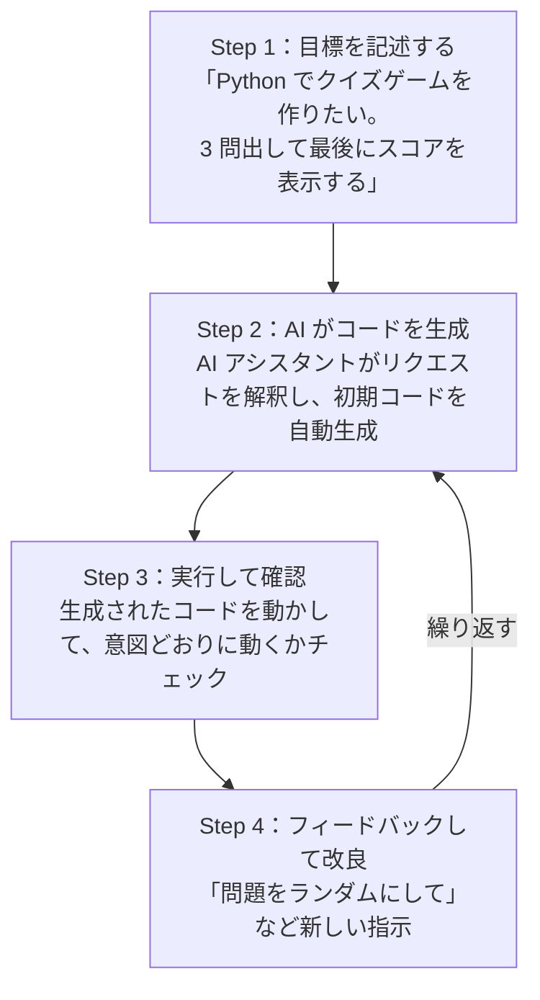

# Lesson-10：バイブコーディング入門（AIを使ったプログラミング体験）

> **区分**: 実践・開発

---

## 1. バイブコーディングとは

### 定義

**バイブコーディング（Vibe Coding）** とは、AI アシスタントと会話するように、アプリケーションを**生成・改良・デバッグ**するソフトウェア開発手法である。

- 2025 年初頭に AI 研究者の **Andrej Karpathy（アンドレイ・カルパシー）** 氏が考案・命名した言葉
- Karpathy 氏は元 Tesla の AI ディレクターであり、OpenAI の共同創業者の一人でもある
- 「Vibe（バイブ）」は「雰囲気・感覚」を意味し、コードの細かい文法を気にせず、作りたいものの雰囲気を伝えるだけでアプリが作れることを表している

### バイブコーディングの 3 つの特徴

| 特徴 | 内容 |
|------|------|
| **自然言語で指示** | プログラム言語を知らなくても、普通の言葉で伝えるだけ |
| **AI がコードを生成** | 実際のコード記述は AI が担当。あなたはアイデアに集中できる |
| **すぐに公開できる** | 作ったアプリをそのままインターネットで公開（デプロイ）できる |

### バイブコーディングはなぜ生まれたのか？

従来のプログラミングでは、「アイデアを持っている人」と「コードを書ける人」は別々のことが多かった。

- 「こんなアプリがあったら便利なのに…」と思っても、プログラミングを知らないと作れなかった
- バイブコーディングにより、プログラミングの知識がなくてもアイデアを形にできるようになった

---

## 2. 従来のプログラミングとの比較

| 比較項目 | 従来のプログラミング | バイブコーディング |
|---------|-------------------|----------------|
| コードの作成 | 1 行ずつ手動でコーディング | 自然言語プロンプトから AI が生成 |
| 必要な役割 | アーキテクト・実装者・デバッガ | プロンプター・ガイド・テスター |
| 必要な知識 | 高い（プログラム言語の文法が必須） | 低い（やりたいことを伝えるだけ） |
| 開発スピード | 一般的に遅い | 特に簡単なタスクは非常に速い |
| エラー処理 | コードを理解して手動デバッグ | AI に説明して会話型で修正 |
| コードの理解 | 自分で書いたので理解しやすい | AI 生成のため理解が必要な努力 |

**重要な視点**：バイブコーディングはプログラミングを「なくす」のではなく、「役割を変える」技術。人間は「何を作るか（設計・判断）」に集中し、AI が「どう作るか（実装）」を担当する。

---

## 3. バイブコーディングのプロセス

バイブコーディングは次のサイクルを繰り返す。



---

## 4. バイブコーディングの 2 つのスタイル

### スタイル① 「純粋な」バイブコーディング

「コードの存在さえ忘れる」スタイル。コードを自分では読まず修正しない。

- スピード重視のプロトタイプ（試作品）開発に向いている
- アイデアをすぐに形にしたいときに使う
- リスク：セキュリティや品質の問題が混入しても気づけない

### スタイル② 責任ある AI 活用開発

AI を「ペアプログラマー（一緒にコードを書く相棒）」として活用するスタイル。

- AI が生成したコードをレビュー・テスト・理解しながら開発する
- プログラミングスキルも少しずつ身につけられる
- より品質・安全性が高いコードが書ける

> この授業では「責任ある AI 活用開発」スタイルで進める。コードを完全に理解しなくてもよいが、「何をしているか大まかに把握する」姿勢を持とう。

---

## 5. バイブコーディングのメリットとデメリット

### メリット

| メリット | 内容 |
|---------|------|
| 誰でもアプリを作れる | プログラム言語の知識がなくても、アイデアを形にできる |
| 開発速度が速い | 数分でプロトタイプを作れる |
| 学習ツールとして使える | AI のコードを読んで理解することで、プログラミングを学べる |
| 自分の能力以上のものが作れる | 普段書けないような複雑な処理も AI が担当してくれる |

### デメリット

| デメリット | 内容 |
|-----------|------|
| コードの中身がわからない | 自分で修正・拡張する作業が難しくなる |
| スキルが身につきにくい | 作るだけでは自力でのコーディング力が伸びない |
| セキュリティリスク | AI が生成したコードに脆弱性が含まれていることがある |
| AI が間違ったコードを生成することがある | エラーが起きたり、意図と違う動作になることがある |

---

## 6. 主なバイブコーディングツール

| ツール | 特徴 | 対象 |
|--------|------|------|
| **Google AI Studio** | Gemini モデルでアプリを試作できる Google の公式ツール。ブラウザだけで使える | 初心者向け |
| **V0 by Vercel** | プロンプトで Web アプリを作成。GitHub に保存してデプロイまで可能 | Web 開発向け |
| **Lovable** | ブラウザ上でチャットしながら UI 付き Web アプリを自動生成 | UI/Web 向け |
| **Cursor** | VS Code ベースの AI 統合開発環境。リポジトリ全体を自然言語で変更できる | 中〜上級者 |
| **GitHub Copilot** | GitHub と統合されたコード補完・チャット機能 | 開発者向け |
| **ChatGPT / Claude** | コードの生成・レビュー・デバッグに幅広く使える汎用生成 AI | 誰でも |

> この授業では ChatGPT または Claude を使って Python プログラムを作る。

---

## 7. 実習①：AI に指示してプログラムを作ってみよう

### 手順

1. ChatGPT または Claude を開く
2. 次のプロンプトを入力して Python のコードを生成してもらう
3. 生成されたコードをコピーして実行する
4. 動いたら追加指示で改良する

### プロンプト例 A：おみくじプログラム

```
Python で簡単なおみくじプログラムを作ってください。

条件：
- 「大吉・吉・中吉・小吉・凶」の 5 種類からランダムに選ぶ
- 結果に一言のメッセージも表示する
- 実行するたびに結果が変わる
- コメントで各部分の説明も入れてほしい
```

動いたら試してみよう：

```
「ラッキーカラーもランダムで表示するようにして」
「今日の日付も一緒に表示して」
「最後に「もう一度やりますか？」と聞いて、y と入力したら繰り返すようにして」
```

### プロンプト例 B：簡単な計算機

```
Python で簡単な計算機プログラムを作ってください。

条件：
- 2 つの数字を入力できる
- 足し算・引き算・掛け算・割り算を選べる
- 結果を表示する
- ゼロ除算（0 で割る操作）のエラー処理も入れてほしい
- コメントつきで出力してほしい
```

### プロンプト例 C：やることリスト管理ツール

```
Python でシンプルなやることリスト（To-Do リスト）を作ってください。

条件：
- タスクの追加・表示・削除ができる
- メニュー形式（番号を入力して選ぶ）で操作できる
- 「終了」を選ぶまでループする
- 各機能にコメントを入れてほしい
```

---

## 8. 実習②：バグへの対処

プログラムを実行してエラーが出た場合、AI への伝え方が重要。

### 良い質問の仕方（3 点セット）

```
次のコードを実行したら以下のエラーが出ました。
原因と修正方法を教えてください。

【コード】
（エラーが起きているコードをそのまま貼り付ける）

【エラーメッセージ】
（ターミナルに出たエラーの文字をそのままコピーして貼り付ける）

【やりたかったこと】
（何をするプログラムなのか、どういう動作を期待していたか説明する）
```

### 悪い質問の例と改善

| 悪い例 | 問題点 | 改善後 |
|--------|--------|--------|
| 「動きません」 | 何が起きているかわからない | エラーメッセージを貼り付ける |
| 「なんか変」 | 何が変なのかわからない | 期待する動作と実際の動作を具体的に書く |
| 「エラーが出た」 | どんなエラーかわからない | エラーメッセージ全文をコピー貼り付け |

### 段階的な改良の例

```
（1 回目）「おみくじプログラムを作ってください」
  ↓ 動作確認
（2 回目）「おみくじの結果に応じてラッキーカラーも表示してほしい」
  ↓ 動作確認
（3 回目）「プログラムをもっとシンプルに書き直してほしい」
  ↓ 動作確認
（4 回目）「今日の日付も一緒に表示するようにしてほしい」
  ↓ 動作確認
（5 回目）「エラーが起きたとき（例外処理）の対処も入れてほしい」
```

### コードを理解するためのプロンプト

生成されたコードが何をしているか理解したいときは：

```
上記のコードについて、
・このコード全体の流れを日本語で説明してください
・各行に日本語のコメントを付けてください
・特に重要な部分（ここを変えると動作が変わる箇所）を教えてください
```

---

## 振り返り：バイブコーディングの流れ

授業で体験したことをまとめよう。

| ステップ | 自分でやったこと |
|---------|---------------|
| 1. 指示を出す | やりたいことを自然言語で説明した |
| 2. コードを確認する | AI が生成したコードを実行した |
| 3. 改良・修正する | エラーが出たり、機能を追加しながら対話を重ねた |
| 4. 完成させる | 少しずつブラッシュアップして、動くプログラムができた |

---

## 宿題：次回（Lesson-11）に向けて

次回はバイブコーディングで**自分のオリジナルアプリ**を作る。

次回の授業までに「作りたいもの」を考えておこう。

**アイデアのヒント（難易度順）**

| レベル | アイデア例 |
|--------|----------|
| 入門 | おみくじ・数当てゲーム・じゃんけん・簡単な計算機 |
| 標準 | クイズゲーム（テーマは自由）・To-Do リスト・BMI 計算機 |
| 挑戦 | 成績管理アプリ・タイピング練習・占い診断・簡単なメモ帳 |
