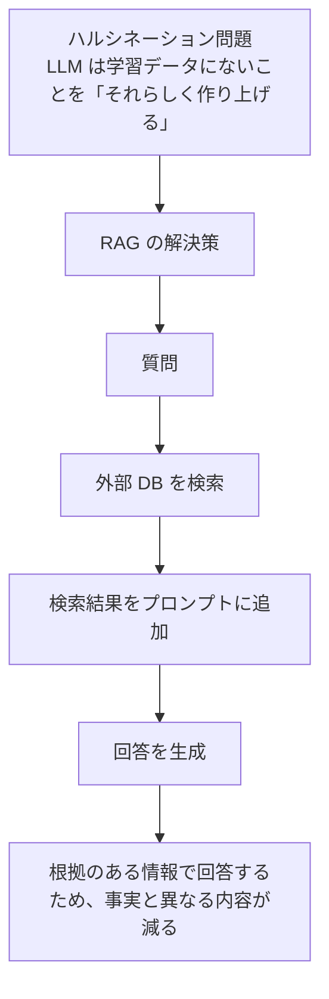
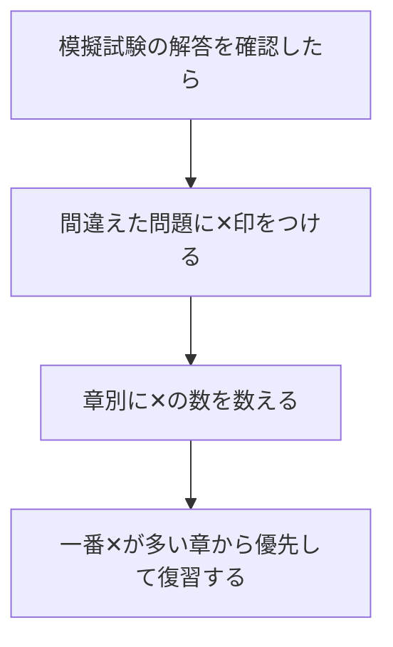

# Lesson-12：総復習・直前対策（模擬試験・弱点補強）

> **対象章**: 全章（第1〜5章）

---

## 参照資料

以下の資料も参考にしよう。

- [生成 AI 直前対策講座](../../old_document/生成AI直前対策講座/)
- [総復習スライド](../../old_document/##_生成AIパスポート～総復習～.pdf)

---

## 試験前の心構え

模擬試験を始める前に確認しよう。

| 心構え | 説明 |
|--------|------|
| 本番のつもりで取り組む | 見直しや辞書を使わず、制限時間を守る |
| 間違えても落ち込まない | 今ここで間違えることで、本番での失点を防げる |
| 解けない問題は飛ばす | 止まらず、わかるものから先に解いて戻ってくる |
| 選択肢は全部読む | 「なんとなく正解に見える」で選ぶと引っかかる |

---

## 模擬試験①：第1・2章（AI の基礎知識・生成 AI の誕生）

**制限時間：20 分　｜　全 10 問**

---

**問1**：次のうち、ANI（特化型 AI）の説明として正しいものを選びなさい。

ア. 人間と同等に何でもできる汎用型 AI
イ. 特定のタスクに特化して設計された AI
ウ. まだ実現していない理論上の AI
エ. ロボットと一体化した AI

---

**問2**：ダートマス会議で「人工知能」という言葉を提唱した人物は誰か。

ア. レイ・カーツワイル
イ. ヴァーナー・ヴィンジ
ウ. ジョン・マッカーシー
エ. ジェフリー・ヒントン

---

**問3**：機械学習の手法のうち、「報酬」を設定して最適な行動を学習させるものはどれか。

ア. 教師あり学習
イ. 教師なし学習
ウ. 強化学習
エ. 半教師あり学習

---

**問4**：AI が学習データに適応しすぎて、未知のデータに対応できなくなる状態を何というか。

ア. ドロップアウト
イ. 正則化
ウ. 過学習（オーバーフィッティング）
エ. 転移学習

---

**問5**：Transformer の特徴として正しいものはどれか。

ア. 画像の局所特徴を畳み込みで抽出するモデル
イ. 自己注意機構を使って並列処理が可能なモデル
ウ. 過去の情報を記憶するリカレント構造を持つモデル
エ. データを圧縮して復元する生成モデル

---

**問6**：GPT-3.5 の土台となった InstructGPT で採用された、人間のフィードバックをもとに AI を調整する手法の略称を書きなさい。

（解答欄：　　　　　　　　）

---

**問7**：BERT の学習方法のうち、「ランダムに単語を隠して前後の文脈から当てさせる」方法を何というか。

ア. NSP（Next Sentence Prediction）
イ. RLHF（Reinforcement Learning from Human Feedback）
ウ. MLM（Masked Language Model）
エ. AGI（Artificial General Intelligence）

---

**問8**：シンギュラリティとは何か。15 字以内で答えなさい。

（解答欄：　　　　　　　　　　　　　　　）

---

**問9**：GAN（敵対的生成ネットワーク）を構成する 2 つのネットワークの名前を答えなさい。

（解答欄：①　　　　　　　　　②　　　　　　　　）

---

**問10**：ディープラーニングと従来の機械学習の最大の違いを 1 文で答えなさい。

（解答欄：　　　　　　　　　　　　　　　　　　　　　　　）

---

## 模擬試験②：第3・4・5章（動向・リテラシー・プロンプト）

**制限時間：20 分　｜　全 10 問**

---

**問11**：RAG（Retrieval-Augmented Generation）の仕組みの説明として正しいものを選びなさい。

ア. AI が自ら新しい知識を発明する仕組み
イ. 外部の知識ベースから検索した情報をプロンプトに加えて回答を生成する仕組み
ウ. AI 同士が競い合ってより良い回答を生成する仕組み
エ. 複数の AI が協力して回答を生成する仕組み

---

**問12**：生成 AI の出力に事実と異なる情報が含まれる現象を何というか。

（解答欄：　　　　　　　　　　　　　　　　）

---

**問13**：SMS を使ったフィッシング詐欺を何というか。

ア. ヴィッシング
イ. スミッシング
ウ. スピアフィッシング
エ. プレテキスト

---

**問14**：個人情報保護法において、人種・病歴・犯罪歴など特に慎重な取り扱いが必要な個人情報を何というか。

（解答欄：　　　　　　　　　　　　　）

---

**問15**：知的財産権のうち、「登録不要で自動的に発生し、作者の死後 70 年保護される」権利はどれか。

ア. 特許権　　イ. 意匠権　　ウ. 商標権　　エ. 著作権

---

**問16**：文化庁の 2025 年 2 月の見解によると、AI が自律的に生成した作品は著作物にあたるか。

ア. あたる
イ. あたらない
ウ. 著作者が AI の開発企業になる
エ. 法的には不明

---

**問17**：AI 社会の 3 つの基本理念（Dignity・Diversity & Inclusion・Sustainability）のうち、「Sustainability」の意味として正しいものはどれか。

ア. 人間の尊厳が尊重される社会
イ. 多様な背景を持つ人が幸せを追求できる社会
ウ. 持続可能な社会
エ. AI の安全性が確保される社会

---

**問18**：プロンプトの 4 要素のうち、「AI に何をすべきか指示する」要素の名前を答えなさい。

（解答欄：　　　　　　　　　　）

---

**問19**：例示を 2〜3 個与えてから質問するプロンプティングの名前を答えなさい。

ア. Zero-Shot プロンプティング
イ. Few-Shot プロンプティング
ウ. Chain-of-Thought プロンプティング
エ. Template プロンプティング

---

**問20**：AI エージェントと MCP の組み合わせについて説明した次の文の（　）に入る言葉を書きなさい。

「MCP（Model Context Protocol）は、AI モデルと（　　　　）や（　　　　）を、標準化された方法でつなぐためのプロトコルである。」

（解答欄：　　　　　　　　　　　　　　　）

---

## 模擬試験 解答・解説

### 模擬試験① 解答

| 問 | 正解 | 解説 |
|----|------|------|
| 1 | **イ** | ANI（Artificial Narrow Intelligence）は将棋 AI や音声認識など特定タスクに特化した AI。AGI が汎用型。 |
| 2 | **ウ** | 1956 年のダートマス会議でジョン・マッカーシーが「AI」という言葉を提唱した。カーツワイルはシンギュラリティ提唱者。 |
| 3 | **ウ** | 強化学習は「行動 → 報酬 → 学習」の繰り返し。囲碁 AI（AlphaGo）が有名な応用例。 |
| 4 | **ウ** | 過学習（オーバーフィッティング）は訓練データを「丸暗記」しすぎた状態。正則化・ドロップアウトが対策として使われる。 |
| 5 | **イ** | Transformer は「Attention Is All You Need」（2017）で発表。自己注意機構（Self-Attention）で全トークンの関係を同時に計算できる。アはCNN、ウはRNN/LSTM、エはVAEの説明。 |
| 6 | **RLHF** | Reinforcement Learning from Human Feedback の略。人間が複数の回答をランク付けし、それを報酬として AI を調整する。 |
| 7 | **ウ** | MLM（Masked Language Model）は BERT の事前学習で用いる手法。NSP は「2 文が連続しているか」を当てる別の学習タスク。 |
| 8 | **AI が人間の知能を超える転換点** | レイ・カーツワイルが 2045 年と予測。ヴァーナー・ヴィンジが概念を提唱した。 |
| 9 | **①生成器（Generator）　②識別器（Discriminator）** | 生成器が偽物を作り、識別器が本物か偽物かを判別する。二者が競い合う（敵対する）ことで精度が向上する。 |
| 10 | **ディープラーニングは特徴量を AI が自動で学習するが、従来の機械学習は特徴量を人間が設計・抽出する必要がある。** | ディープラーニングは「特徴量エンジニアリング不要」が最大の革新点。 |

---

### 模擬試験② 解答

| 問 | 正解 | 解説 |
|----|------|------|
| 11 | **イ** | RAG = 検索（Retrieval）＋生成（Augmented Generation）。ハルシネーションを抑え、最新情報に対応できる。 |
| 12 | **ハルシネーション（Hallucination）** | LLM が確率的に次のトークンを選ぶ仕組みから生まれる。事実確認（ファクトチェック）が必須。 |
| 13 | **イ** | スミッシング（SMS Phishing）。ヴィッシングは電話を使ったもの。スピアフィッシングは特定個人を狙ったもの。 |
| 14 | **要配慮個人情報** | 漏洩時の差別・不利益が特に大きい情報。人種・信条・社会的身分・病歴・犯罪歴・身体障害などが該当。 |
| 15 | **エ（著作権）** | 著作権は創作した瞬間に自動発生（無方式主義）。特許権は出願が必要で保護期間は 20 年。 |
| 16 | **イ** | 文化庁 2025 年 2 月の見解：「AI が自律的に生成したものは著作物にあたらない」。ただし人間が創意工夫を加えた場合は著作物になりうる。 |
| 17 | **ウ** | Dignity = 尊厳、Diversity & Inclusion = 多様性と包括性、Sustainability = 持続可能性。三者をセットで覚える。 |
| 18 | **Instruction（命令・指示）** | 4 要素：Context（背景）・Instruction（指示）・Input Data（入力データ）・Output Indicator（出力形式の指定）。 |
| 19 | **イ（Few-Shot）** | Few-Shot は例示付き。Zero-Shot は例示なし。Chain-of-Thought は思考ステップを示す手法。 |
| 20 | **外部のデータソース・ツール** | MCP は AI モデルとデータソース（DB、ファイルなど）およびツール（API、コードなど）を標準化した接続方法でつなぐ。 |

---

## 弱点補強：混同しやすいキーワード対比表

### ANI vs AGI

| 項目 | ANI | AGI |
|------|-----|-----|
| 正式名称 | Artificial Narrow Intelligence | Artificial General Intelligence |
| 日本語 | 特化型 AI | 汎用型 AI |
| 現状 | 実現済み（将棋 AI・音声認識など） | まだ実現していない |
| 例 | ChatGPT・AlphaGo・推薦システム | 人間と同様に何でもできる AI |

### スミッシング vs ヴィッシング vs スピアフィッシング

| 種類 | 使うツール | ターゲット |
|------|-----------|----------|
| スミッシング | SMS（テキストメッセージ） | 不特定多数 |
| ヴィッシング | 電話・音声通話 | 不特定多数 |
| スピアフィッシング | メール | 特定の個人・組織 |

### 著作権 vs 特許権 vs 意匠権 vs 商標権

| 権利 | 対象 | 登録 | 保護期間 |
|------|------|------|---------|
| 著作権 | 文章・音楽・絵など創作物 | 不要（自動発生） | 死後 70 年 |
| 特許権 | 発明・技術 | 必要 | 出願から 20 年 |
| 意匠権 | デザイン・形状 | 必要 | 登録から 25 年 |
| 商標権 | ブランド名・ロゴ | 必要 | 登録から 10 年（更新可能） |

### Zero-Shot vs One-Shot vs Few-Shot

| 手法 | 例示の数 | 向いている場面 |
|------|---------|-------------|
| Zero-Shot | 0 個 | シンプルな質問・一般知識 |
| One-Shot | 1 個 | 出力スタイルを軽く指定したいとき |
| Few-Shot | 2〜3 個 | 特定の形式・ニュアンスを再現させたいとき |

### 過学習の対策手法

| 手法 | 内容 |
|------|------|
| 正則化 | 重みが大きくなりすぎないようにペナルティを与える |
| ドロップアウト | 学習中に一部のニューロンをランダムに無効化する |
| アーリーストッピング | 検証データの精度が下がり始めたら学習を止める |
| データ拡張 | 画像の回転・反転などで訓練データを人工的に増やす |
| 転移学習 | 大量データで学習済みのモデルを流用・微調整する |

### GAN vs VAE vs 拡散モデル

| 手法 | 学習の仕組み | 特徴 |
|------|-----------|------|
| GAN | 生成器 vs 識別器の競合 | リアルな画像生成が得意・学習が不安定 |
| VAE | エンコーダ（圧縮）＋デコーダ（復元） | 潜在空間を学習・生成物がやや「ぼやける」 |
| 拡散モデル | ノイズ追加 → ノイズ除去を学習 | 現在の主流・高品質な画像生成 |

### RAG の目的とハルシネーションの関係



---

## 総まとめ：章ごとの重要ポイント早見表

### 第1章：AI の基礎知識

| キーワード | 意味 |
|-----------|------|
| ANI / AGI | 特化型 AI / 汎用型 AI |
| 教師あり学習 | 正解ラベル付きデータで学習（回帰・分類） |
| 教師なし学習 | 正解なしでデータの構造を発見（クラスタリング） |
| 強化学習 | 報酬をもとに最適な行動方策を学習 |
| 半教師あり学習 | ラベルありデータ少量＋なしデータ大量で学習 |
| ノーフリーランチ定理 | どんな問題にも万能な学習手法は存在しない |
| 過学習の対策 | 正則化・ドロップアウト・アーリーストッピング・転移学習 |
| シンギュラリティ | AI が人間の知能を超える転換点（カーツワイル：2045年予測） |
| AI Effect | AI ができるようになると「それは本当の知能ではない」と思われる現象 |

### 第2章：生成 AI の誕生と系譜

| キーワード | 意味 |
|-----------|------|
| GAN | 生成器 + 識別器が競い合う生成モデル（2014年提案） |
| VAE | エンコーダ（圧縮）＋デコーダ（復元）の生成モデル |
| CNN | 畳み込み層で画像の局所特徴を抽出するNN（ImageNet で活躍） |
| Transformer | 自己注意機構で並列処理・長距離依存を解決（2017年） |
| BERT | MLM + NSP、双方向での文脈理解（Google, 2018年） |
| GPT-1/2/3 | OpenAI による次トークン予測で自己回帰学習するLLM |
| RLHF | 人間フィードバックによる強化学習（InstructGPT で採用） |
| アライメント | AI を人間の意図・価値観に沿わせる調整 |
| ハルシネーション | AI が事実と異なる情報を自信を持って生成する現象 |
| Constitutional AI | Anthropic が採用：AI に倫理ガイドラインを自己評価させる手法 |

### 第3章：現在の生成 AI の動向

| キーワード | 意味 |
|-----------|------|
| マルチモーダル AI | テキスト・画像・音声など複数の情報形式を扱う AI |
| 拡散モデル | ノイズを除去して画像を生成する現在の主流手法 |
| ディープフェイク | AI で作られたリアルな偽コンテンツ（C2PA が対抗技術） |
| ディスインフォメーション | 意図的に作られ拡散される偽情報 |
| ミスインフォメーション | 悪意のない誤情報 |
| RAG | 外部情報を検索してプロンプトに加える仕組み |
| チャンク・ベクトル DB | RAG の核：文書を分割し、数値ベクトルに変換して保存 |
| コサイン類似度 | ベクトルの「向き」の近さで意味的類似度を測る指標 |
| AI エージェント | 自律的に計画・実行・確認を繰り返す AI |
| MCP | AI と外部ツール・データソースをつなぐ共通プロトコル |

### 第4章：情報リテラシー・AI 倫理・法規制

| キーワード | 意味 |
|-----------|------|
| フィッシング | 偽サイト・メールで個人情報を騙し取る攻撃 |
| スミッシング / ヴィッシング | SMS / 電話を使ったフィッシング詐欺 |
| スピアフィッシング | 特定個人・組織を狙った精巧なフィッシング |
| ランサムウェア | 暗号化して身代金を要求するマルウェア |
| ソーシャルエンジニアリング | 人間の心理・行動を利用した情報詐取 |
| 要配慮個人情報 | 病歴・人種など特に慎重な扱いが必要な個人情報 |
| 匿名加工情報 | 個人を識別できないよう加工した情報 |
| 著作権 | 登録不要で自動発生（死後 70 年保護） |
| 特許権 | 発明を守る（出願から 20 年） |
| 文化庁見解（2025年2月）| AI 自律生成物は著作物にあたらない |
| 営業秘密 | 秘密管理性・有用性・非公知性の 3 要件を満たす情報 |
| Dignity / D&I / Sustainability | AI 社会の 3 つの基本理念 |
| リスクベースアプローチ | AI のリスクに応じて規制の強度を変える方法 |
| AI 新法 | 2025 年 6 月交付の日本初の AI 包括法 |
| EU AI Act | 欧州の AI 規制法：リスクに応じて 4 段階に分類 |

### 第5章：プロンプトエンジニアリング

| キーワード | 意味 |
|-----------|------|
| 言語モデル（LM） | 次の単語を確率的に予測するモデル |
| 大規模言語モデル（LLM） | 大量データで学習した超大型の言語モデル |
| Temperature | 出力の自由度：高い→多様・低い→決まった回答 |
| Top-p（核サンプリング）| 次の候補語を累積確率 p% で絞る方式 |
| Context（文脈・背景） | AI の役割・前提条件を設定する要素 |
| Instruction（命令・指示）| AI に何をすべきか指示する要素 |
| Input Data（入力データ）| AI に処理させる実際のデータ |
| Output Indicator（出力形式）| 出力の形式・文字数・スタイルを指定する要素 |
| Zero-Shot | 例示なしで質問 |
| One-Shot | 1 例を示してから質問 |
| Few-Shot | 2〜3 例を示してから質問 |
| Chain-of-Thought | 「順を追って考えてください」と思考プロセスを促す手法 |

---

## 試験に出やすい歴史・人名

| 年 | 出来事 | 関係者 |
|----|--------|--------|
| 1950 | チューリングテストを提唱 | アラン・チューリング |
| 1956 | ダートマス会議で「AI」命名 | ジョン・マッカーシー |
| 1986 | 誤差逆伝播法（バックプロパゲーション）の実証 | ジェフリー・ヒントンら |
| 2012 | ImageNet 競技で深層学習が圧勝 | ヒントンの研究チーム（AlexNet） |
| 2014 | GAN を提案 | イアン・グッドフェロー |
| 2017 | Transformer 論文「Attention Is All You Need」発表 | Google Brain チーム |
| 2018 | BERT 発表（Google） | Google AI |
| 2020 | GPT-3 発表（1750 億パラメータ） | OpenAI |
| 2022 | ChatGPT 公開 | OpenAI |
| 2023 | GPT-4・Gemini・Claude 2 など各社モデル競争が加速 | 各社 |
| 2024 | ヒントンら ノーベル物理学賞受賞 | ジェフリー・ヒントン・ジョン・ホップフィールド |
| 2025 | 日本 AI 新法 交付（6月） | 日本政府 |
| 2025 | 文化庁 AI 著作権に関する見解 公表（2月） | 文化庁 |
| 2025 | バイブコーディング（Vibe Coding）命名 | アンドレイ・カルパシー |
| 2045 | シンギュラリティ予測年 | レイ・カーツワイル |

---

## 直前確認：自己テスト（口頭で答えてみよう）

次の問いに 30 秒以内で答えられるか確認しよう。

1. ハルシネーションとは何か？（1 文で）
2. RAG の目的を一言で説明せよ。
3. RLHF の略称を展開して、どんな手法か説明せよ。
4. スミッシングとヴィッシングの違いは？
5. 著作権と特許権の違いを保護対象と期間で比べよ。
6. Transformer が RNN・LSTM より優れている点は？
7. プロンプトの 4 要素を日本語で言え。
8. Zero-Shot と Few-Shot の違いを例示で説明せよ。
9. GAN の 2 つのネットワーク名と役割を言え。
10. 文化庁の 2025 年 AI 著作権見解を 1 文で説明せよ。

---

## 試験本番に向けたアドバイス

### 1. キーワードを「意味」で覚える

略語（RLHF、LLM、RAG など）は必ず展開できるようにしておくこと。

```
例）
  RLHF → Reinforcement Learning from Human Feedback
         （人間のフィードバックを使った強化学習）
  RAG  → Retrieval-Augmented Generation
         （検索を組み合わせた生成）
  MCP  → Model Context Protocol
         （モデルとツールをつなぐ標準プロトコル）
```

### 2. 似ているものをペアで整理する

- スミッシング（SMS）vs ヴィッシング（電話）
- Zero-Shot（例なし）vs Few-Shot（例あり）
- ANI（特化型）vs AGI（汎用型）
- ハルシネーション（事実誤り）vs ディスインフォメーション（意図的な偽情報）
- 著作権（自動発生）vs 特許権（出願必要）

### 3. 「誰が・いつ・何を」を意識する

歴史・人名は混同しやすい。特に注意：

| 混同しやすい組み合わせ | 正しい対応 |
|---------------------|-----------|
| ダートマス会議とカーツワイル | ダートマス会議 → マッカーシー |
| シンギュラリティとヴィンジ | シンギュラリティ概念 → ヴィンジ、2045年予測 → カーツワイル |
| バイブコーディングの命名者 | カルパシー（元 Tesla AI Director、元 OpenAI 共同創業者） |
| ノーベル賞受賞者 | ヒントン・ホップフィールド（2024年物理学賞） |

### 4. 不安な章の問題を繰り返す

この授業で間違えた問題を中心に復習すること。

**弱点の見つけ方**：



### 5. 試験当日は落ち着いて

- わからない問題で止まらず、解けるものを先に解いて戻ってくる
- 選択肢は「消去法」も使う（絶対に違うものを消す）
- 解き終わったら見直しの時間を作る

---

## この授業で学んだこと：6 ヶ月間の振り返り

| レッスン | テーマ | 一言まとめ |
|---------|--------|-----------|
| Lesson-01 | AI の基礎知識 | AI は道具。できることとできないことを正しく知る |
| Lesson-02 | 機械学習の手法 | 4 つの学習手法と過学習対策がポイント |
| Lesson-03 | 生成 AI の誕生 | GAN・VAE・Transformer で生成 AI の土台が作られた |
| Lesson-04 | GPT・LLM の進化 | RLHF・ハルシネーション・アライメントを理解する |
| Lesson-05 | 現在の AI 動向 | マルチモーダル・RAG・エージェント・MCP |
| Lesson-06 | リテラシー・倫理・法 | 個人情報・著作権・フィッシング・AI の入力ルール |
| Lesson-07 | AI 社会の原則 | Dignity・D&I・Sustainability とリスクベース規制 |
| Lesson-08 | プロンプトの基礎 | 4 要素・Temperature・Zero/Few-Shot |
| Lesson-09 | プロンプト実践 | 文章系・ビジネス応用・AI の不得意・反復改善 |
| Lesson-10 | バイブコーディング入門 | AI と対話してコードを作る新しい開発スタイル |
| Lesson-11 | バイブコーディング実践 | 要件定義→MVP→改良→発表の開発サイクル体験 |
| Lesson-12 | 総復習・直前対策 | 弱点を確認して、試験本番に備える |

---

これまでの 12 回の授業、本当にお疲れさまでした。

この講座で学んだ「AI を正しく理解し、使いこなす力」は試験だけでなく、これからの社会を生きるうえで欠かせないスキルです。

AI は便利なツールですが、**使い方を判断し、責任を持つのは人間**です。みなさんが AI を正しく・賢く・安全に使える大人に育っていくことが、この授業の最終目標でした。

自信を持って試験本番に臨んでください！
